# CIA/BIV-analyse – OpenMRS Appointment Scheduling Module

## 1. Korte beschrijving van de module

Voor dit project is gekozen voor de **OpenMRS Appointment Scheduling Module**. Deze module wordt gebruikt om patiëntafspraken te plannen en te beheren binnen OpenMRS. Volgens de README is de module bedoeld voor het plannen van patiëntafspraken, het beheren van roosters van zorgverleners en het beheren van de patient queue. [REF-01]

De module verwerkt onder andere patiëntafspraken, zorgverlenersroosters, tijdsloten, afspraaktypes, locaties en afspraakstatussen. Dit blijkt uit de domeinklassen in de code, zoals `Appointment`, `ProviderSchedule`, `TimeSlot`, `AppointmentBlock`, `AppointmentType` en `AppointmentStatusHistory`.

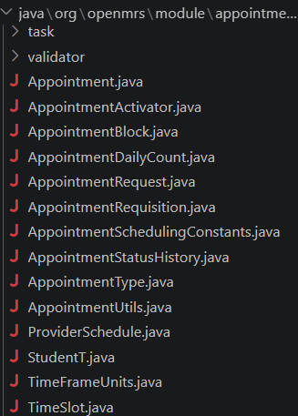

---

## 2. CIA/BIV-analyse

| Onderdeel         | Beoordeling | Uitleg                                                                                                                                                                 | Codebewijs                |
| ----------------- | ----------- | ---------------------------------------------------------------------------------------------------------------------------------------------------------------------- | ------------------------- |
| Vertrouwelijkheid | Hoog        | Afspraakgegevens kunnen herleidbaar zijn naar patiënten. Een afspraak kan indirect medische context onthullen, bijvoorbeeld via afspraaktype, locatie of zorgverlener. | 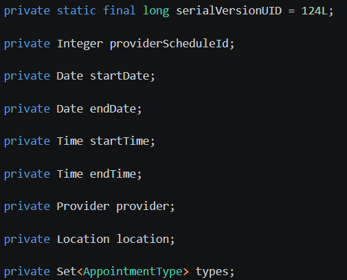  |
| Integriteit       | Zeer hoog   | Afspraakgegevens moeten correct zijn. Een verkeerde patiënt, tijd, zorgverlener of status kan het zorgproces verstoren.                                                | 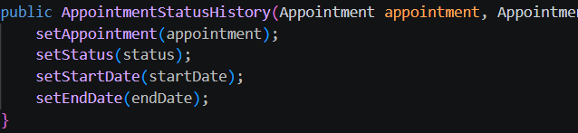  |
| Beschikbaarheid   | Hoog        | Zorgmedewerkers moeten afspraken, roosters en de patient queue kunnen gebruiken. Als de module niet beschikbaar is, wordt het plannen van zorg verstoord.              | 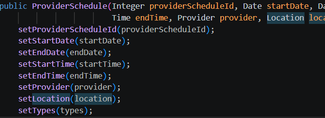 |

---

## 3. Kroonjuwelen

Kroonjuwelen zijn de belangrijkste gegevens of onderdelen van het systeem die extra goed beschermd moeten worden.

| Kroonjuweel                     | Waarom belangrijk?                                                                                                    | BIV-impact                      | Codebewijs toevoegen                              |
| ------------------------------- | --------------------------------------------------------------------------------------------------------------------- | ------------------------------- | ------------------------------------------------- |
| Patiëntafspraken                | Bevat informatie over welke patiënt wanneer zorg ontvangt.                                                            | Vertrouwelijkheid + integriteit | 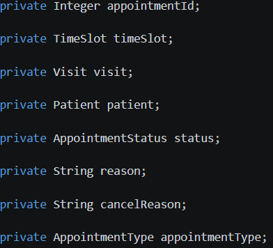                          |
| Patiëntkoppeling                | Een afspraak wordt gekoppeld aan een specifieke patiënt. Hierdoor zijn afspraakgegevens herleidbaar naar een persoon. | Vertrouwelijkheid               | 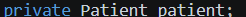                          |
| Zorgverlenerroosters            | Bepaalt wanneer zorgverleners beschikbaar zijn voor afspraken.                                                        | Integriteit + beschikbaarheid   |                           |
| Tijdsloten / appointment blocks | Bepalen wanneer afspraken ingepland kunnen worden. Fouten hierin kunnen leiden tot verkeerde planning.                | Integriteit + beschikbaarheid   | 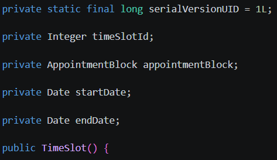 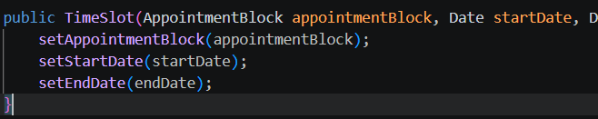 |
| Afspraaktypes                   | Het type afspraak kan medische context verraden.                                                                      | Vertrouwelijkheid               | 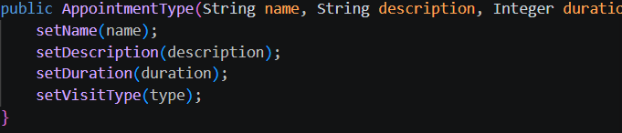                          |
| Locatiegegevens                 | De locatie bepaalt waar een afspraak plaatsvindt. Een verkeerde locatie kan leiden tot gemiste afspraken.             | Integriteit                     | 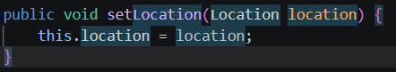                          |
| Afspraakstatussen               | De status geeft aan of een afspraak gepland, afgerond, geannuleerd of gemist is.                                      | Integriteit                     | 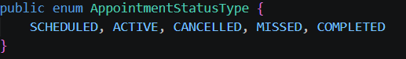                          |

---

## 4. Risicocriteria

Voor de risicoanalyse gebruiken we de formule:

```text
Risico = Kans × Impact
```

De kans geeft aan hoe waarschijnlijk het is dat een risico optreedt. De impact geeft aan hoe ernstig de gevolgen zijn voor patiëntprivacy, afspraakjuistheid of beschikbaarheid van het zorgproces.

### Kansscore

| Score | Kans      | Betekenis                              |
| ----: | --------- | -------------------------------------- |
|     1 | Zeer laag | Bijna onmogelijk                       |
|     2 | Laag      | Kan gebeuren, maar niet waarschijnlijk |
|     3 | Middel    | Realistisch mogelijk                   |
|     4 | Hoog      | Waarschijnlijk                         |
|     5 | Zeer hoog | Komt waarschijnlijk vaak voor          |

### Impactscore

| Score | Impact    | Betekenis                                                            |
| ----: | --------- | -------------------------------------------------------------------- |
|     1 | Zeer laag | Nauwelijks effect                                                    |
|     2 | Laag      | Kleine verstoring                                                    |
|     3 | Middel    | Merkbare verstoring of beperkte datablootstelling                    |
|     4 | Hoog      | Gevoelige gegevens of belangrijk zorgproces geraakt                  |
|     5 | Zeer hoog | Ernstige privacy-impact, verkeerde zorgplanning of langdurige uitval |

---

## 5. Risicoschaal

| Risicoscore | Niveau  | Actie                                 |
| ----------: | ------- | ------------------------------------- |
|         1–4 | Laag    | Accepteren                            |
|         5–9 | Middel  | Monitoren en waar mogelijk verbeteren |
|       10–15 | Hoog    | Maatregel verplicht                   |
|       16–25 | Kritiek | Direct oplossen of mitigeren          |

---

## 6. Risicobereidheid en grenswaarden

Omdat de Appointment Scheduling Module werkt met patiëntafspraken, is de risicobereidheid laag voor risico’s die patiëntprivacy, afspraakjuistheid of zorgcontinuïteit raken.

De grenswaarden zijn:

- Lage risico’s worden geaccepteerd.
- Middelgrote risico’s worden gemonitord.
- Hoge risico’s moeten worden verminderd met maatregelen.
- Kritieke risico’s zijn niet acceptabel en moeten direct worden aangepakt.
- Risico’s waarbij patiëntgegevens onbevoegd zichtbaar worden, worden niet zonder maatregel geaccepteerd.
- Risico’s waarbij afspraken verkeerd gewijzigd of verwijderd kunnen worden, moeten worden verminderd.
- Risico’s waarbij de planning langdurig niet beschikbaar is, moeten worden verminderd.
