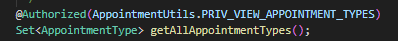
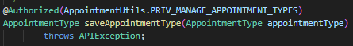
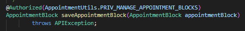
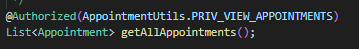
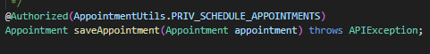
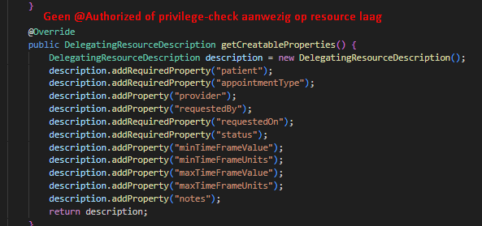
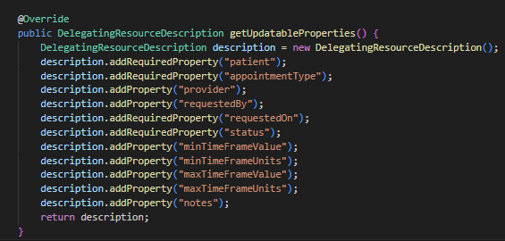
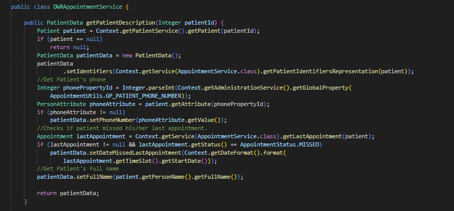

# Gap-analyse — Appointment Scheduling Module

| | |
|---|---|
| **Norm** | NEN-7510:2024-2 |
| **Module** | openmrs-module-appointmentscheduling v2.0.0 |
| **Datum** | 2026-06-03 |
| **Auteur** | Enes |

---

## Inleiding

Een gap-analyse vergelijkt de **huidige staat** van een systeem met een **gewenste norm of standaard**. Het woord "gap" staat voor de kloof tussen wat er is en wat er moet zijn. In de context van informatiebeveiliging wordt per control bepaald of een maatregel:

| Status | Betekenis |
|---|---|
| ✅ Aanwezig | Volledig geïmplementeerd en aantoonbaar in de code |
| ⚠️ Gedeeltelijk | Deels geïmplementeerd, maar met ontbrekende elementen |
| ❌ Afwezig | Niet geïmplementeerd of niet aantoonbaar |

Het resultaat is een prioriteitenlijst van beveiligingsmaatregelen die nog ontbreken of versterkt moeten worden.

---

## Scope

De analyse richt zich op drie NEN-7510:2024-2 controls die direct van toepassing zijn op een module die gevoelige medische gegevens verwerkt (patiëntafspraken, zorgverleners, tijdsgegevens):

| Control | Onderwerp | Status |
|---|---|---|
| A.8.3 | Toegangsbeveiliging | ⚠️ Gedeeltelijk |
| A.8.5 | Authenticatie | ❌ Afwezig |
| A.8.15 | Logging en monitoring | ⚠️ Gedeeltelijk |

---

## A.8.3 — Toegangsbeveiliging

### Eis

> Toegang tot informatie en systemen moet worden beperkt op basis van het vastgestelde toegangsbeleid. Gebruikers mogen alleen toegang hebben tot de gegevens en functies die zij voor hun taak nodig hebben *(need-to-know / least privilege)*.

### Bevinding — ⚠️ Gedeeltelijk aanwezig

De module maakt op de **service-laag** consequent gebruik van OpenMRS `@Authorized`-annotaties. Elke service-methode is voorzien van een privilege-check die door het OpenMRS-framework wordt gehandhaafd bij aanroep.

#### Bewijs: aanwezig

**Bestand:** `api/src/main/java/org/openmrs/module/appointmentscheduling/api/AppointmentService.java`

```java
// Regel 60
@Authorized(AppointmentUtils.PRIV_VIEW_APPOINTMENT_TYPES)

// Regel 128
@Authorized(AppointmentUtils.PRIV_MANAGE_APPOINTMENT_TYPES)

// Regel 214
@Authorized(AppointmentUtils.PRIV_MANAGE_APPOINTMENT_BLOCKS)

// Regel 294
@Authorized(AppointmentUtils.PRIV_VIEW_APPOINTMENTS)

// Regel 335
@Authorized(AppointmentUtils.PRIV_SCHEDULE_APPOINTMENTS)
```







In totaal zijn er **97 `@Authorized`-annotaties** aanwezig in `AppointmentService.java`, wat aantoont dat toegangsbeveiliging op service-laag systematisch is toegepast.

#### Bewijs: gap

De REST-resources en de DWR-laag bevatten **geen eigen autorisatiecontroles**. Ze delegeren alle aanroepen door naar de service-laag zonder zelf te controleren of de aanroeper de juiste rechten heeft.

**Bestand:** `omod/.../rest/resource/openmrs1_9/AppointmentRequestResource1_9.java`

```java
// Regel 72 — geen @Authorized aanwezig
public DelegatingResourceDescription getCreatableProperties() { ... }

// Regel 89 — geen @Authorized aanwezig
public DelegatingResourceDescription getUpdatableProperties() { ... }
```




**Bestand:** `omod/.../web/DWRAppointmentService.java`

```
→ Geen @Authorized of privilege-check aanwezig in het gehele bestand
```



### Risico
> Als de service-laag wordt omzeild (via een directe REST-aanroep of toekomstige refactoring), is er geen tweede verdedigingslinie. De module biedt geen *defense-in-depth*.

---

## A.8.5 — Authenticatie

### Eis

> Systemen moeten gebruikers authenticeren voordat toegang wordt verleend. Authenticatiemechanismen moeten sterk genoeg zijn voor het risiconiveau van de verwerkte gegevens. Sessies moeten beveiligd worden beheerd.

### Bevinding — ❌ Afwezig (in de module zelf)

De module bevat **geen eigen authenticatielogica**. Er is geen code aanwezig die:

- een sessie valideert of controleert op geldigheid
- wachtwoordbeleid afdwingt
- meervoudige authenticatie (MFA) ondersteunt of vereist
- een verlopen sessie detecteert en afhandelt

De module delegeert authenticatie volledig aan het OpenMRS-platform (Spring Security). Dit is een gangbare ontwerpkeuze voor OpenMRS-modules, maar betekent dat de beveiliging volledig afhankelijk is van de platformconfiguratie — buiten de controle van de module.

#### Bewijs: afwezig

Zoekopdracht uitgevoerd op alle `.java`-bestanden in de module:

```bash
grep -rn "HttpSession|SecurityContext|AuthenticationManager|isAuthenticated|getSession"
```

```
→ Geen resultaten gevonden in productie-code
```

Er is geen enkele aanroep naar authenticatiegerelateerde klassen of methoden aangetroffen.

De zoekopdracht controleert op de volgende authenticatiegerelateerde klassen en methoden:

| Term | Betekenis |
|---|---|
| `HttpSession` | Java-object dat een gebruikerssessie bijhoudt na het inloggen. Aanwezigheid betekent dat de module actief sessies beheert. |
| `SecurityContext` | Spring Security-object dat de huidige ingelogde gebruiker opslaat. Code die dit aanroept wil weten *wie* er momenteel ingelogd is. |
| `AuthenticationManager` | Het centrale Spring Security-component dat authenticatie uitvoert — controleert of een gebruikersnaam/wachtwoord klopt. |
| `isAuthenticated()` | Methode die controleert of de huidige gebruiker daadwerkelijk ingelogd is en de sessie nog geldig is. |
| `getSession()` | Haalt de huidige HTTP-sessie op uit een request om sessiedata te lezen, schrijven of te controleren. |

Geen van deze termen komt voor in de productie-code. Dit bewijst dat de module volledig op het OpenMRS-platform vertrouwt en zelf niets controleert rondom authenticatie of sessiebeheer.

### Risico

> De module verwerkt gevoelige medische gegevens. Als het OpenMRS-platform onvoldoende is geconfigureerd (geen sessietime-out, geen MFA, zwak wachtwoordbeleid), biedt de module zelf geen compenserende maatregelen.

> NEN-7510:2024-2 beoordeelt het **systeem als geheel** — niet alleen de platformlaag. De norm vereist dat een organisatie aantoonbaar kan maken dat authenticatie correct is geïmplementeerd en geconfigureerd voor alle systemen die medische gegevens verwerken. Omdat de module zelf geen enkele authenticatiecontrole bevat en er geen gedocumenteerde eis bestaat aan de platformconfiguratie, is er geen garantie dat aan A.8.5 wordt voldaan. Bij een audit kan de module niet zelfstandig compliance aantonen: de verantwoordelijkheid ligt volledig buiten de module, zonder dat dit ergens is vastgelegd of afgedwongen.

---

## A.8.15 — Logging en monitoring

### Eis

> Gebeurtenissen die relevant zijn voor informatiebeveiliging moeten worden gelogd. Logbestanden moeten minimaal bevatten: **wie** de actie uitvoerde, **welke actie** werd uitgevoerd, en **wanneer**. Dit geldt in het bijzonder voor toegang tot en wijzigingen van gevoelige gegevens.

### Bevinding — ⚠️ Gedeeltelijk aanwezig

De module bevat slechts **1 audit-logstatement** in de volledige implementatiecode.

#### Bewijs: aanwezig (enige audit-logregel)

**Bestand:** `api/.../api/impl/AppointmentServiceImpl.java`

```java
// Regel 1427
log.info("[AUDIT] Fetching appointments for patient: name=" + patient.getPersonName()
         + ", id=" + patient.getPatientId());
```

De overige logging in de module betreft uitsluitend technische fouten — geen audit:

```java
// AppointmentBlockEditor.java, AppointmentEditor.java, TimeSlotEditor.java — Regel 46
log.error("Error setting text: " + text, ex);
```

#### Bewijs: gap — kritieke acties zonder audit-logging

| Actie | Bestand | Ontbrekend |
|---|---|---|
| Afspraak aanmaken | `AppointmentServiceImpl.java` | Geen audit-log bij `saveAppointment()` |
| Afspraak wijzigen | `AppointmentServiceImpl.java` | Geen audit-log bij statuswijziging |
| Afspraak annuleren | `AppointmentServiceImpl.java` | Geen audit-log |
| Afspraakblok aanmaken/wijzigen | `AppointmentServiceImpl.java` | Geen audit-log |
| Toegang geweigerd (privilege-fout) | Alle service-methoden | Geen log bij autorisatiefout |

### Risico

> Bij een beveiligingsincident of audit is het niet mogelijk te reconstrueren wie welke afspraken heeft aangemaakt, gewijzigd of geannuleerd. Dit is in strijd met de NEN-7510-eis voor herleidbaarheid van handelingen met medische gegevens.

---

## Samenvatting

| Control | Onderwerp | Status | Voornaamste gap |
|---|---|---|---|
| **A.8.3** | Toegangsbeveiliging | ⚠️ Gedeeltelijk | `@Authorized` alleen op service-laag; REST/DWR-laag mist eigen autorisatiecontroles |
| **A.8.5** | Authenticatie | ❌ Afwezig | Geen authenticatielogica in de module; volledig afhankelijk van platformconfiguratie |
| **A.8.15** | Logging | ⚠️ Gedeeltelijk | Slechts 1 audit-logstatement; aanmaken, wijzigen en annuleren niet gelogd |

---

## Aanbevelingen

| Prioriteit | Control | Aanbeveling |
|---|---|---|
| 🔴 Hoog | A.8.15 | Voeg audit-logging toe aan alle `save*`, `cancel*` en `purge*` methoden in `AppointmentServiceImpl.java` met minimaal: wie, wat, wanneer |
| 🔴 Hoog | A.8.5 | Voeg sessievalidatie toe of documenteer expliciet welke platformconfiguratie vereist is voor NEN-7510-compliance |
| 🟡 Middel | A.8.3 | Voeg privilege-checks toe op de REST-resource-laag als tweede verdedigingslinie (defense-in-depth) |
