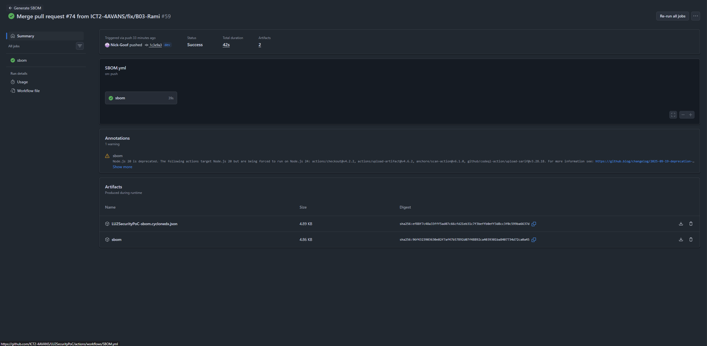
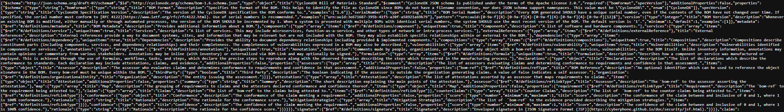
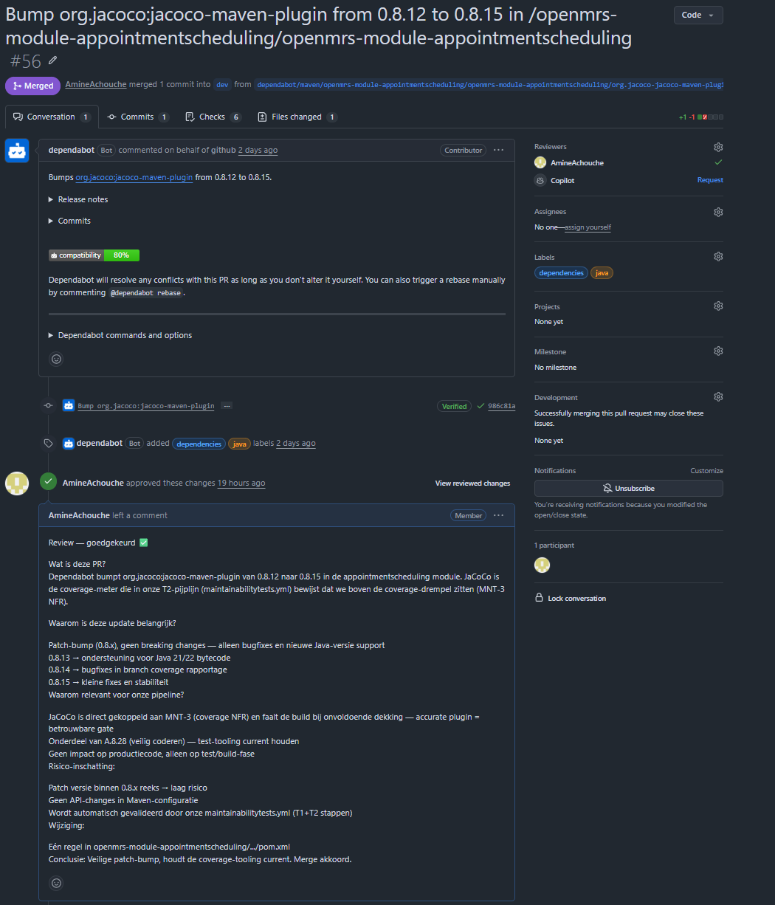
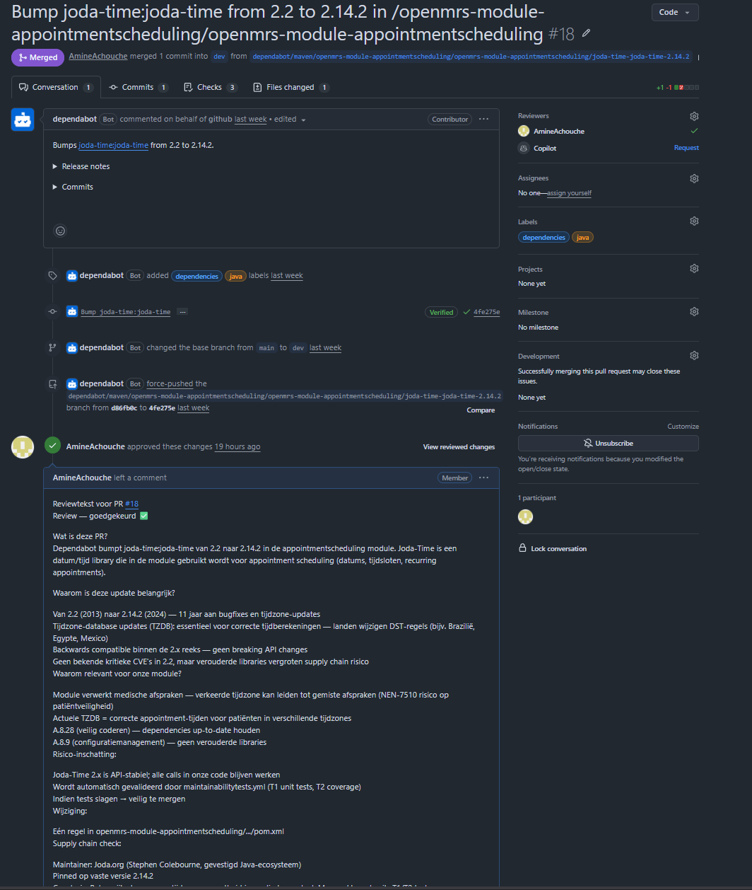
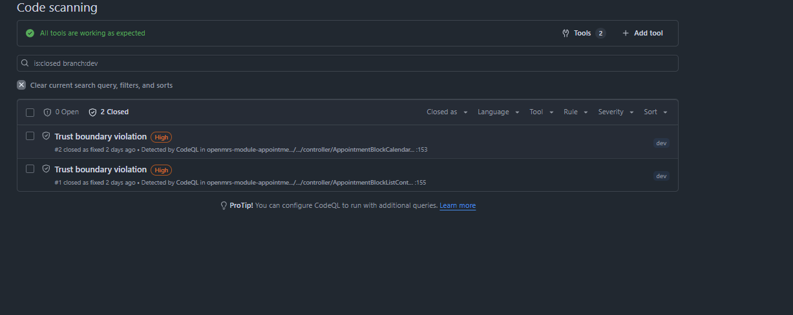
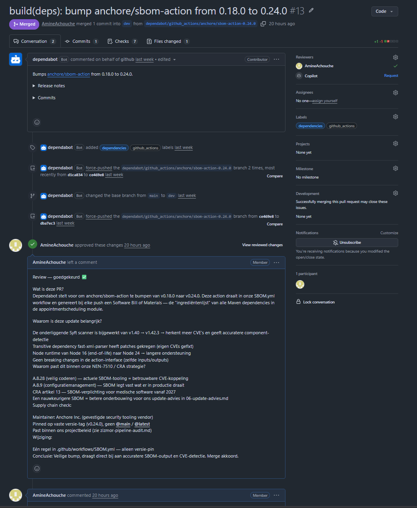

# CRA-mapping — Cyber Resilience Act

| | |
|---|---|
| **Wet** | Cyber Resilience Act (CRA) — EU 2024/2847 |
| **Scope** | openmrs-module-appointmentscheduling 1.17.0-SNAPSHOT |
| **Datum** | 2026-06-18 |
| **Auteur** | Amine |
| **Relatie** | Complementair aan NEN-7510:2024-2 audit |

---

## 1. Wat is de CRA

De **Cyber Resilience Act** (Verordening EU 2024/2847) is op 10 december 2024 in werking getreden. De wet stelt verplichte cybersecurity-eisen aan fabrikanten van producten met digitale elementen die in de EU worden verkocht of gebruikt. Medische software zoals OpenMRS valt onder de **Klasse I** categorie (verhoogd risico).

**Tijdlijn:**
- December 2025 — meldplicht kwetsbaarheden (artikel 14) van kracht
- December 2027 — volledige verplichting voor alle producten

De CRA overlapt sterk met **NEN-7510:2024-2**: waar NEN-7510 de norm is voor informatiebeveiliging in de zorg, is de CRA de wettelijke verplichting voor softwarefabrikanten.

---

## 2. Toepasselijke CRA-vereisten

De CRA bevat in **Artikel 13** en **Bijlage I** concrete technische eisen. Hieronder worden de relevante eisen gemapt op onze implementatie.

---

## 3. CRA-mapping

### Artikel 13 — Verplichtingen fabrikanten

| CRA-eis | Artikel | Status | Bewijs in dit project |
|---|---|---|---|
| SBOM bijhouden in machineleesbaar formaat | Art. 13 lid 3 | ✅ Geïmplementeerd | `SBOM.yml` genereert CycloneDX JSON bij elke push — artifact per CI-run |
| Kwetsbaarheden actief monitoren | Art. 13 lid 6 | ✅ Geïmplementeerd | Dependabot (wekelijks), Snyk, OWASP Dependency-Check — zie `06-update-advies.md` |
| Kwetsbaarheden tijdig patchen | Art. 13 lid 6 | ✅ Geïmplementeerd | B-01, B-02, B-04, B-07, B-10, B-11 gemitigeerd — zie `05-pentest-bevindingen.md` |

---

## Bewijs

### Bewijs 1 — PR #13: anchore/sbom-action 0.18.0 → 0.24.0 (CRA Art. 13 lid 3)

*Dependabot PR #13 gemerged: `anchore/sbom-action` bijgewerkt naar v0.24.0. Syft scanner v1.42.3 genereert nauwkeurigere CycloneDX SBOM. Bewijs van actief dependency-beheer conform CRA Art. 13 lid 3 (SBOM-verplichting).*

---

### Bewijs 2 — CycloneDX SBOM inhoud (CRA Art. 13 lid 3)

*Gegenereerde SBOM in CycloneDX JSON formaat met alle Maven-dependencies van de appointmentscheduling module. Machineleesbaar en direct bruikbaar voor CVE-koppeling. Bewijs dat de SBOM-verplichting (CRA Art. 13 lid 3) is ingevuld.*

---

### Bewijs 3 — PR #56: jacoco-maven-plugin 0.8.12 → 0.8.15 (CRA Art. 13 lid 6)

*Dependabot PR #56 gemerged: patch-bump van de JaCoCo coverage-plugin. Bewijs van actief patch-beheer conform CRA Art. 13 lid 6 (kwetsbaarheden tijdig patchen). Review-commentaar toont onderbouwde risico-inschatting voor de merge.*

---

### Bewijs 4 — PR #18: joda-time 2.2 → 2.14.2 (CRA Art. 13 lid 6)

*Dependabot PR #18 gemerged: 11 jaar TZDB updates voor de `joda-time` library. Kritisch voor correcte appointment-tijden in medische context. Bewijs van risico-gebaseerd dependency-beheer (CRA Art. 13 lid 6).*

---

### Bewijs 5 — PR #13 review (CRA Art. 13 lid 1 — secure development)

*Inhoudelijke review op PR #13 met onderbouwing van de risico-inschatting: supply chain check (Anchore Inc. als vertrouwde maintainer), NEN-7510 / CRA koppeling, en conclusie. Bewijs van gestructureerd reviewproces conform CRA Art. 13 lid 1.*

---

### Bewijs 6 — CodeQL Security tab (CRA Art. 13 lid 1 — secure development)

*GitHub Security tab met CodeQL bevindingen — bewijs dat statische code-analyse actief draait op de codebase. CodeQL draait automatisch bij elke push/PR op dev en main, conform CRA Art. 13 lid 1 (beveiligde ontwikkelomgeving).*
| Veilige standaardinstellingen (secure by default) | Art. 13 lid 1 | ✅ Geïmplementeerd | Hardcoded credentials verwijderd (B-02, PR #51); admin wachtwoord in `.env` (PR #60) |
| Beveiligde ontwikkelomgeving (secure CI/CD) | Art. 13 lid 1 | ✅ Geïmplementeerd | CodeQL, Snyk SAST, Zizmor pipeline-audit — zie `zizmor-pipeline-audit.md` |
| Minimale aanvalsoppervlak | Art. 13 lid 1 | ✅ Geïmplementeerd | Least privilege in workflows (Zizmor Z-02 fix); RBAC via OpenMRS |
| Bescherming van integriteit en vertrouwelijkheid | Art. 13 lid 1 | ⚠️ Gedeeltelijk | B-05 (PII logging) nog open; B-08 opgelost (PR #79) |

---

### Artikel 14 — Meldplicht kwetsbaarheden

| CRA-eis | Artikel | Status | Bewijs in dit project |
|---|---|---|---|
| Kwetsbaarheden documenteren | Art. 14 lid 1 | ✅ Geïmplementeerd | 11 bevindingen gedocumenteerd in `05-pentest-bevindingen.md` met CVE-referenties |
| Kwetsbaarheden rapporteren (intern) | Art. 14 lid 1 | ✅ Geïmplementeerd | Security backlog in `security-backlog.md` + GitHub Issues |
| Geprioriteerde aanpak op CVSS-score | Art. 14 lid 1 | ✅ Geïmplementeerd | Prioritering op CVSS v3.1 scores in `05-pentest-bevindingen.md` + `06-update-advies.md §3` |

---

### Bijlage I — Essentiële cybersecurity-eisen (technisch)

| CRA-eis | Bijlage I | Status | Bewijs in dit project |
|---|---|---|---|
| **Geen bekende exploiteerbare kwetsbaarheden** bij oplevering | §1 lid 1 | ⚠️ Gedeeltelijk | 6/11 bevindingen gemitigeerd; resterende open bevindingen zijn gedocumenteerd met risico-acceptatie |
| **Authenticatie en toegangscontrole** | §1 lid 2 | ✅ Geïmplementeerd | RBAC via OpenMRS (A.8.3 gap-analyse); CSRF-bescherming toegevoegd B-07 (PR #55); trust boundary B-10/B-11 (PR #57) |
| **Geen hardcoded credentials** | §1 lid 3 | ✅ Geïmplementeerd | B-02 opgelost (PR #51) + geautomatiseerde test `AppointmentActivatorHardcodedCredentialsTest` |
| **Bescherming van persoonsgegevens** (PII) | §1 lid 5 | ⚠️ Gedeeltelijk | B-05 (PII in audit log) nog open; B-08 (debug logging) opgelost (PR #79) |
| **Bescherming van integriteit van data** | §1 lid 6 | ✅ Geïmplementeerd | SQL injection fix B-01 (PR #49); IDOR gedocumenteerd B-03 |
| **Minimale aanvalsoppervlak** | §1 lid 8 | ✅ Geïmplementeerd | Privilege escalation fix B-04 (PR #52); DWR endpoint beveiligd B-07 |
| **Logging en auditspoor** | §1 lid 9 | ⚠️ Gedeeltelijk | Audit logging aanwezig (A.8.15 gap-analyse); B-06 geaccepteerd risico |
| **Software Bill of Materials (SBOM)** | §2 lid 1 | ✅ Geïmplementeerd | CycloneDX SBOM via `anchore/sbom-action@v0.24.0` in CI |
| **Veilige supply chain** | §2 lid 2 | ✅ Geïmplementeerd | Dependabot + `06-update-advies.md`; Zizmor pipeline-audit; geen `@latest` tags |
| **Beleid voor verantwoorde openbaarmaking** | §2 lid 5 | ✅ Geïmplementeerd | Bevindingen gedocumenteerd + geprioriteerd; gefixte bevindingen publiek in GitHub PR-historie |

---

## 4. Overlap CRA ↔ NEN-7510

| NEN-7510 control | CRA equivalent |
|---|---|
| A.8.3 Toegangsbeveiliging | Bijlage I §1 lid 2 (authenticatie & toegangscontrole) |
| A.8.5 Authenticatie | Bijlage I §1 lid 2 + Artikel 13 lid 1 |
| A.8.8 Kwetsbaarheidsbeheer | Artikel 13 lid 6 + Artikel 14 |
| A.8.9 Configuratiemanagement | Bijlage I §2 lid 2 (supply chain) |
| A.8.15 Logging | Bijlage I §1 lid 9 |
| A.8.28 Veilig coderen | Artikel 13 lid 1 (secure development) |

NEN-7510 en CRA zijn grotendeels **complementair**: voldoen aan NEN-7510 levert automatisch bewijs voor de CRA-vereisten. Dit project dekt beide normen via dezelfde maatregelen.

---

## 5. Restrisico en openstaande punten

| Punt | CRA-artikel | Reden open | Mitigatie |
|---|---|---|---|
| B-03 IDOR | Bijlage I §1 lid 6 | Complexe fix, vereist service-laag wijziging | Netwerksegmentatie + authenticatie als compenserende maatregel |
| B-05 PII logging | Bijlage I §1 lid 5 | Niet tijdig geïmplementeerd | Geplande fix na inlevering |
| B-09 XSS | Bijlage I §1 lid 2 | Moeilijke fix (CodeQL bevinding) | Content Security Policy als compenserende maatregel |
| Unpinned GitHub Actions (Z-01) | Art. 13 lid 1 | Tag-pinning voldoende voor PoC-scope | Commit-SHA pinning aanbevolen voor productie |

---

## 6. Conclusie

Het project voldoet aan de **kern-CRA-vereisten** voor een PoC-omgeving:
- SBOM aanwezig en machineleesbaar (CycloneDX JSON)
- Kwetsbaarheden gedocumenteerd, geprioriteerd en deels gemitigeerd
- Veilige supply chain via Dependabot + Zizmor
- Geen hardcoded credentials
- Authenticatie en toegangscontrole geborgd

De resterende open punten (B-03, B-05, B-09) zijn gedocumenteerd met risico-acceptatie en compenserende maatregelen, conform artikel 13 lid 6 CRA (risicobeheer op basis van proportionaliteit). B-08 is opgelost ([PR #79](https://github.com/ICT2-4AVANS/LU2SecurityPoC/pull/79)).

Voor een productie-oplevering conform CRA (deadline december 2027) is een volledige migratie naar OpenMRS Platform 2.x vereist (zie `06-update-advies.md §8.2`).
