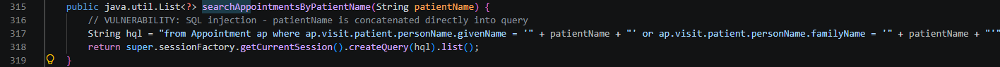
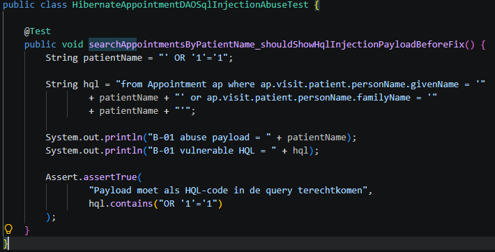
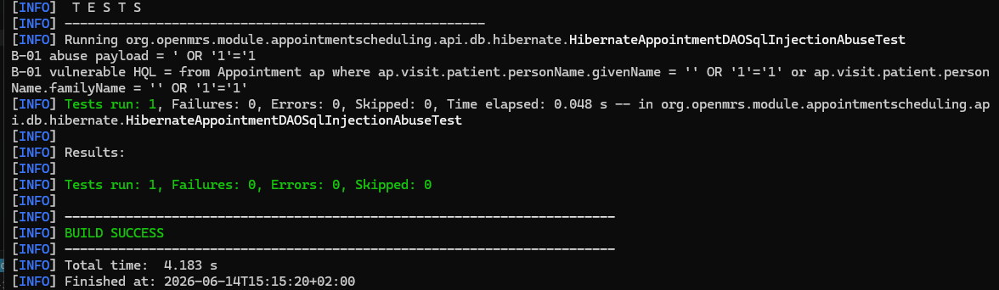
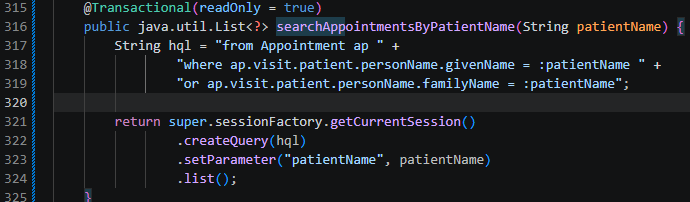
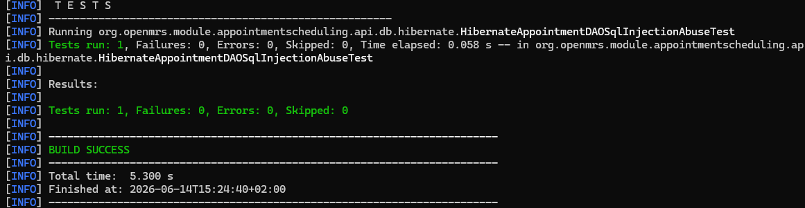

# B-01 — SQL Injection in zoekfunctie

## Gegevens

| Onderdeel | Informatie                     |
| --------- | ------------------------------ |
| Bevinding | B-01                           |
| Ernst     | Critical                       |
| Titel     | SQL Injection in zoekfunctie   |
| Bestand   | `HibernateAppointmentDAO.java` |
| Regel     | ± regel 315                    |
| NEN-7510  | A.8.3                          |
| Branch    | `fix/b01-nick`                 |

## Probleem

In `HibernateAppointmentDAO.java` werd de parameter `patientName` direct in een HQL-query geplakt. Hierdoor kon gebruikersinput de query beïnvloeden. Een payload zoals:

```text
' OR '1'='1
```

kan ervoor zorgen dat de `WHERE`-voorwaarde altijd waar wordt. Daardoor kan de zoekfunctie meer afspraken teruggeven dan bedoeld, bijvoorbeeld afspraken van andere patiënten.

Op onderstaande foto is de kwetsbare code vóór de aanpassing te zien. Hier wordt `patientName` direct met string-concatenatie in de HQL-query gezet.



## Abuse aantonen

Voor B-01 is gecontroleerd of de methode `searchAppointmentsByPatientName` via een bestaande controller of UI-route werd aangeroepen. Dit bleek niet het geval te zijn. Daarom is de abuse aangetoond met een test in de API-laag.

De test gebruikt de payload:

```text
' OR '1'='1
```

Hiermee wordt zichtbaar dat de payload vóór de fix letterlijk in de HQL-query terechtkomt. Daardoor wordt de querylogica manipuleerbaar.

Op onderstaande foto staat de abuse-test die dit aantoont.



Onderstaande foto laat zien dat de test vóór de aanpassing succesvol draait. Daarmee is aangetoond dat de kwetsbare query-opbouw misbruikt kan worden.



## Fix

De fix is om geen string-concatenatie meer te gebruiken, maar een geparametriseerde HQL-query.

De query is aangepast naar:

```java
String hql = "from Appointment ap " +
        "where ap.visit.patient.personName.givenName = :patientName " +
        "or ap.visit.patient.personName.familyName = :patientName";

return super.sessionFactory.getCurrentSession()
        .createQuery(hql)
        .setParameter("patientName", patientName)
        .list();
```

Hierdoor wordt `patientName` als parameter meegegeven en niet meer als onderdeel van de HQL-code geïnterpreteerd.

Op onderstaande foto is de aangepaste code te zien. Hier zie je dat `:patientName` en `.setParameter("patientName", patientName)` worden gebruikt.



## Test na de fix

Na de fix is de test aangepast zodat gecontroleerd wordt dat:

- de query een named parameter gebruikt;
- `patientName` via `setParameter(...)` wordt gebonden;
- `patientName` niet meer direct met string-concatenatie in de query wordt gezet.

De test is uitgevoerd met:

```powershell
mvn -Dtest=HibernateAppointmentDAOSqlInjectionAbuseTest test
```

Onderstaande foto laat zien dat de test na de aanpassing succesvol is uitgevoerd.



## Resultaat

B-01 is opgelost. De kwetsbare HQL-string-concatenatie is vervangen door een geparametriseerde query. Hierdoor kan een payload zoals `' OR '1'='1` de query niet meer manipuleren.
