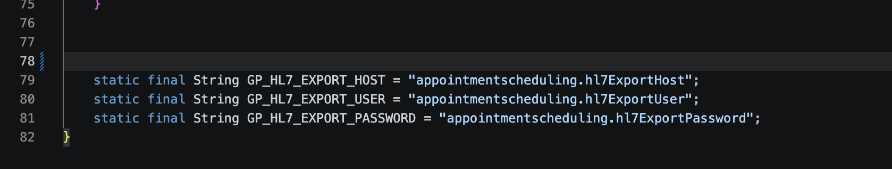
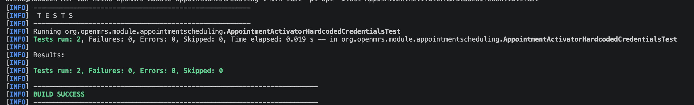

# B-02 — Hardcoded credentials in broncode

## Gegevens

| Onderdeel | Informatie |
|---|---|
| Bevinding | B-02 |
| Ernst | Critical |
| Titel | Hardcoded credentials in broncode |
| Bestand | `AppointmentActivator.java` |
| Regel | 78–82 |
| NEN-7510 | A.8.5 — Authenticatie |
| Branch | `fix/b02-amine` |

## Probleem

In `AppointmentActivator.java` stonden vier velden hardcoded in de broncode:

- `HL7_EXPORT_HOST`
- `HL7_EXPORT_USER`
- `HL7_EXPORT_PASSWORD` — bevat het plaintext wachtwoord `Appt@Export2021!`
- `HL7_DB_URL` — bevat de volledige JDBC URL inclusief gebruikersnaam én wachtwoord (dubbeling van de bovenstaande velden)

De `HL7_DB_URL` is verwijderd en niet vervangen door een aparte GlobalProperty omdat de URL altijd samengesteld kan worden uit host, user en password — een losse URL-property zou credentials dupliceren.

Iedereen met leestoegang tot de repository beschikt hiermee direct over de databasecredentials van het HL7-rapportagesysteem. Omdat het wachtwoord in de git-historie staat, is verwijdering uit de broncode niet voldoende zonder historieschoning.

### Vóór de fix — code

```java
// HL7 reporting server credentials for appointment data export
private static final String HL7_EXPORT_HOST = "hl7-reports.hospital.internal";
private static final String HL7_EXPORT_USER = "appt_export_svc";
private static final String HL7_EXPORT_PASSWORD = "Appt@Export2021!";
private static final String HL7_DB_URL = "jdbc:mysql://hl7-reports.hospital.internal:3306/appointments?user=appt_export_svc&password=Appt@Export2021!";
```

## Fix

De vier hardcoded velden zijn verwijderd. In plaats daarvan worden drie GlobalProperty-sleutels gedefinieerd zodat credentials via de OpenMRS-beheerinterface of omgevingsvariabelen worden ingesteld:

```java
static final String GP_HL7_EXPORT_HOST     = "appointmentscheduling.hl7ExportHost";
static final String GP_HL7_EXPORT_USER     = "appointmentscheduling.hl7ExportUser";
static final String GP_HL7_EXPORT_PASSWORD = "appointmentscheduling.hl7ExportPassword";
```

Credentials worden nu nooit meer opgeslagen in de broncode.

### Na de fix — code



## Test

### Test vóór de fix

De test zou falen als de hardcoded credentials nog aanwezig waren — het wachtwoord zou gevonden worden in een `String`-veld.

### Test na de fix



`AppointmentActivatorHardcodedCredentialsTest.java` verifieert:

1. Geen enkel `String`-veld in `AppointmentActivator` bevat het bekende wachtwoord of de JDBC URL
2. De drie GlobalProperty-sleutels zijn aanwezig en niet leeg

## Aanvullende maatregel — git-historie schonen

Omdat het wachtwoord in de git-historie staat moet de historie worden geschoond:

```bash
git filter-repo --replace-text <(echo 'Appt@Export2021!==>REDACTED')
```

of via **BFG Repo Cleaner**:

```bash
bfg --replace-text passwords.txt
git push --force
```

Na historieschoning moeten alle teamleden de repo opnieuw clonen.
