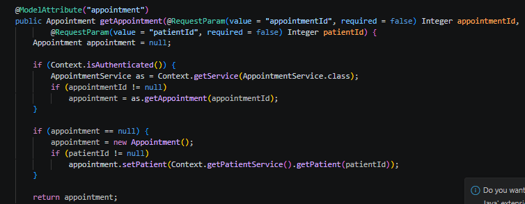
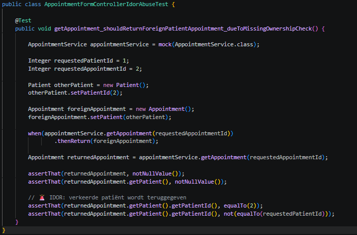
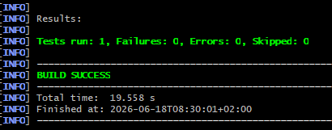
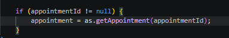
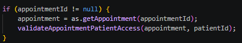
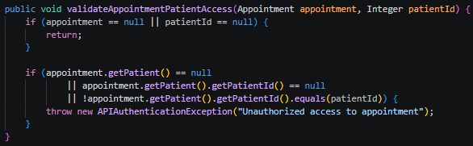
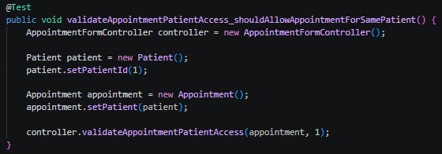
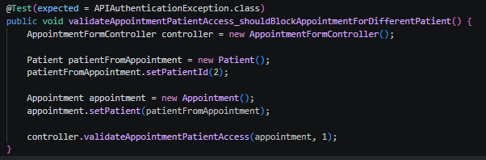
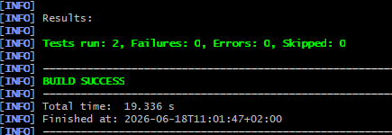

# B-03 — IDOR afspraken andere patiënten

## Gegevens

| Onderdeel | Informatie                       |
| --------- | -------------------------------- |
| Bevinding | B-03                             |
| Ernst     | Critical                         |
| Titel     | IDOR afspraken andere patiënten  |
| Bestand   | `AppointmentFormController.java` |
| Regel     | ± regel 94                       |
| NEN-7510  | A.8.3                            |
| Branch    | `fix/B03-Rami`           |

## Probleem

In `AppointmentFormController.java` wordt een afspraak opgehaald op basis van de request-parameter `appointmentId`.

De kwetsbare code haalt direct een afspraak op:

```java
if (appointmentId != null)
    appointment = as.getAppointment(appointmentId);
```

Daarna wordt de opgehaalde afspraak teruggegeven:

```java
return appointment;
```

Het probleem is dat er niet wordt gecontroleerd of deze afspraak ook echt hoort bij de meegegeven `patientId`.

Daardoor ontstaat een **IDOR** kwetsbaarheid. IDOR staat voor **Insecure Direct Object Reference**. Dit betekent dat een gebruiker door het aanpassen of raden van een ID mogelijk toegang kan krijgen tot gegevens van iemand anders.

In dit geval kan een gebruiker proberen een afspraak van een andere patiënt op te halen door een andere `appointmentId` te gebruiken.

Op onderstaande foto is de kwetsbare code vóór de aanpassing te zien. Hier wordt `appointmentId` direct gebruikt om een afspraak op te halen, zonder controle of de afspraak bij de juiste patiënt hoort.



## Abuse aantonen

Voor B-03 is geprobeerd om de abuse via de OpenMRS UI aan te tonen. Dit bleek niet goed uitvoerbaar, omdat de appointment list geen duidelijke knop of zichtbaar `appointmentId` toont waarmee een specifieke afspraak direct geopend kan worden.

Daarom is de abuse aangetoond met een unit test. In deze test wordt de kwetsbare situatie nagebootst.

De abuse werkt als volgt:

```text
patientId=1
appointmentId=2
```

In dit scenario werkt de gebruiker in de context van patiënt 1, maar probeert de gebruiker een afspraak met `appointmentId=2` op te halen. In de test hoort deze afspraak bij patiënt 2.

Vóór de fix controleert de applicatie niet of de afspraak van `appointmentId=2` ook bij `patientId=1` hoort. Daardoor wordt de afspraak van patiënt 2 teruggegeven.

De test gebruikt een mock van `AppointmentService`. Hiermee wordt nagebootst dat `getAppointment(2)` een afspraak van patiënt 2 teruggeeft.



Onderstaande foto laat zien dat de test vóór de aanpassing succesvol draait. Daarmee is aangetoond dat een afspraak van een andere patiënt kan worden teruggegeven wanneer alleen op `appointmentId` wordt vertrouwd.



## Fix

De fix is om na het ophalen van een afspraak te controleren of de afspraak hoort bij de meegegeven patiënt.

De kwetsbare code:




is aangepast naar:




Daarna is deze validatiemethode toegevoegd:




Deze methode controleert:

- of er een afspraak is opgehaald;
- of er een `patientId` is meegegeven;
- of de afspraak een patiënt heeft;
- of de patiënt van de afspraak overeenkomt met de meegegeven `patientId`.

Als de afspraak niet bij de juiste patiënt hoort, wordt de toegang geblokkeerd met:

```java
throw new APIAuthenticationException("Unauthorized access to appointment");
```

Hierdoor kan een gebruiker niet meer via het aanpassen van `appointmentId` een afspraak van een andere patiënt openen.

## Test na de fix

Na de fix zijn twee tests toegevoegd om te controleren dat de nieuwe controle werkt.

De tests controleren twee situaties:

- een afspraak van dezelfde patiënt wordt toegestaan;
- een afspraak van een andere patiënt wordt geblokkeerd.

### Test 1 — afspraak van dezelfde patiënt toestaan

De eerste test controleert dat een afspraak gewoon toegankelijk blijft wanneer de afspraak bij dezelfde patiënt hoort als de meegegeven `patientId`.



Deze test verwacht geen foutmelding, omdat de afspraak hoort bij patiënt 1 en de request ook patiënt 1 gebruikt.

### Test 2 — afspraak van andere patiënt blokkeren

De tweede test controleert dat een afspraak van een andere patiënt wordt geblokkeerd.



Deze test verwacht een `APIAuthenticationException`, omdat de afspraak hoort bij patiënt 2 terwijl de request patiënt 1 gebruikt.

Onderstaande foto laat zien dat de tests na de aanpassing succesvol zijn uitgevoerd.



## Resultaat

B-03 is opgelost.

Voor de fix werd een afspraak opgehaald op basis van alleen `appointmentId`. Daardoor kon een afspraak van een andere patiënt worden teruggegeven zonder controle op `patientId`.

Na de fix controleert de controller of de opgehaalde afspraak hoort bij de meegegeven patiënt.

De tests tonen aan dat:

- een afspraak van dezelfde patiënt nog steeds wordt toegestaan;
- een afspraak van een andere patiënt wordt geblokkeerd met een `APIAuthenticationException`.

Hiermee is de IDOR-kwetsbaarheid opgelost en is de toegangsbeveiliging verbeterd volgens **NEN-7510 A.8.3**.