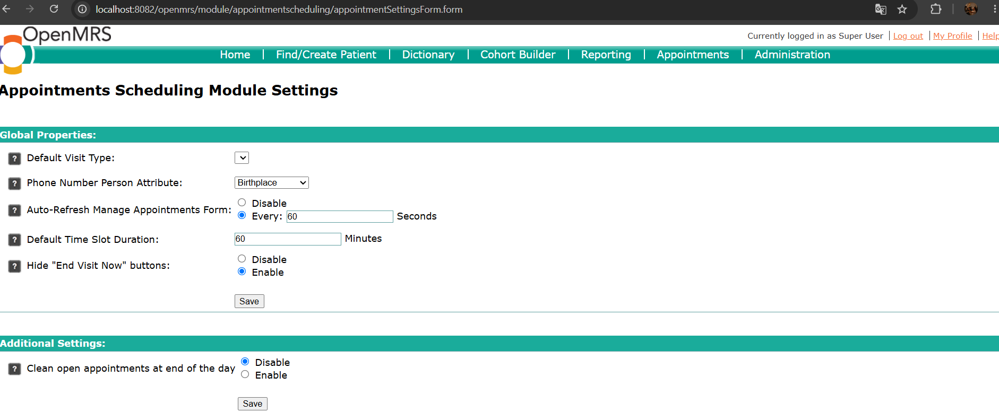
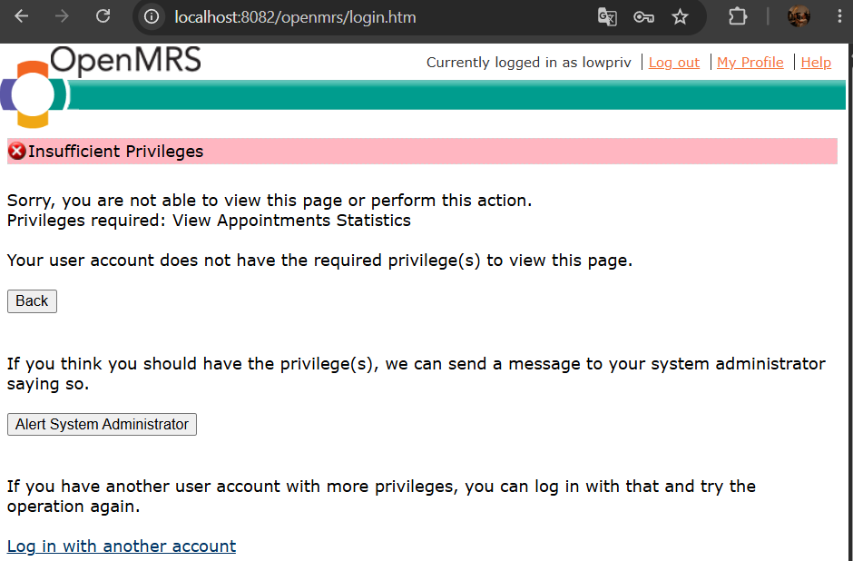
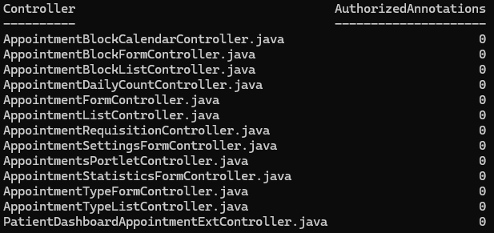
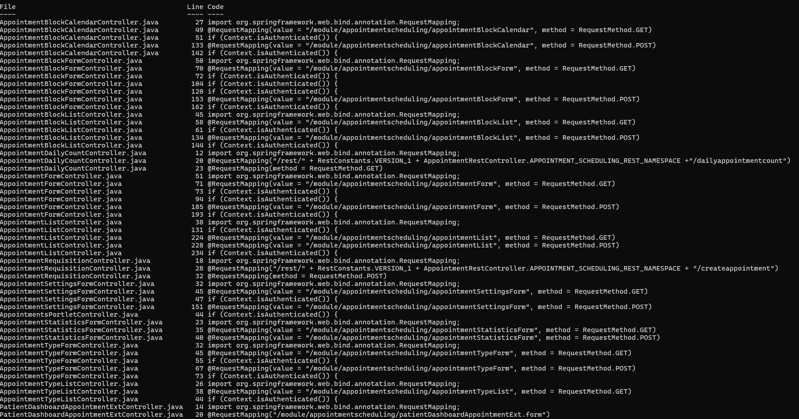
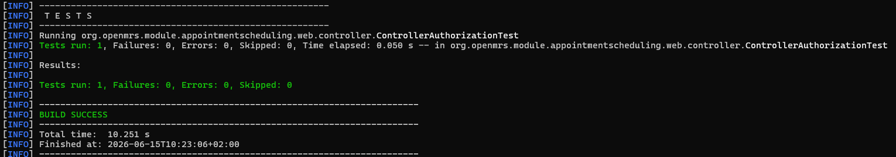
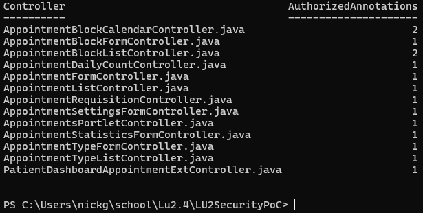

Ik heb de volgende command in powershell uitgevoerd voor deze uitkomst:
PS C:\Users\nickg\school\Lu2.4\LU2SecurityPoC> Get-ChildItem $controllerPath -Filter \*.java |

> > ForEach-Object {
> > $authorizedCount = (Select-String -Path $_.FullName -Pattern "@Authorized" -ErrorAction SilentlyContinue).Count
>>     [PSCustomObject]@{
>>         Controller = $_.Name
>>         AuthorizedAnnotations = $authorizedCount
>>     }
>> } | Format-Table -AutoSize

Ik heb de volgende command in powershell uitgevoerd voor deze uitkomst: 
PS C:\Users\nickg\school\Lu2.4\LU2SecurityPoC> Select-String -Path "$controllerPath\*.java" -Pattern "Context.isAuthenticated|@Authorized|RequestMapping" |
> > ForEach-Object {
> > [PSCustomObject]@{
> > File = Split-Path $_.Path -Leaf
> > Line = $_.LineNumber
> > Code = $\_.Line.Trim()
> > }
> > } | Format-Table -AutoSize -Wrap

