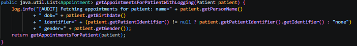
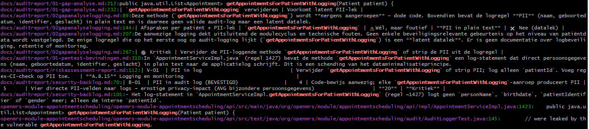

# B-05 — PII gelogd in audit log

## Gegevens

| Onderdeel | Informatie                    |
| --------- | ----------------------------- |
| Bevinding | B-05                          |
| Ernst     | High                          |
| Titel     | PII gelogd in audit log       |
| Bestand   | `AppointmentServiceImpl.java` |
| Regel     | ± regel 1427                  |
| NEN-7510  | A.8.15                        |
| Branch    | `fix/B05-Rami`        |

## Probleem

In `AppointmentServiceImpl.java` stond de methode `getAppointmentsForPatientWithLogging`.

Deze methode schreef patiëntgegevens naar de applicatielog:



Hiermee werden meerdere vormen van PII gelogd:

- patiëntnaam;
- geboortedatum;
- patiëntidentifier;
- geslacht.

Dit is onveilig, omdat logs vaak langer worden bewaard en ook door beheerders of andere systemen ingezien kunnen worden. In een zorgapplicatie mogen zulke patiëntgegevens niet onnodig in logs terechtkomen.

## Abuse aantonen

Voor B-05 is gecontroleerd of de methode `getAppointmentsForPatientWithLogging` ergens actief werd aangeroepen.

Dit is gecontroleerd met:

```bash
git grep -n "getAppointmentsForPatientWithLogging"
```

Uit deze controle bleek dat de methode niet actief werd gebruikt door andere Java-code. De methode was dus dode code, maar bevatte wel een logregel met gevoelige patiëntgegevens.

De abuse werkt conceptueel als volgt:

```text
1. De methode getAppointmentsForPatientWithLogging(patient) wordt aangeroepen.
2. De methode haalt afspraken van de patiënt op.
3. De methode logt naam, geboortedatum, identifier en geslacht.
4. Iemand met toegang tot logs kan deze patiëntgegevens lezen.
```

Daarmee vormt de methode een latent risico: als deze methode later alsnog gebruikt wordt, kunnen persoonsgegevens in de logs terechtkomen.

Op onderstaande foto is de controle met `git grep` te zien. Hieruit blijkt dat de methode niet actief wordt aangeroepen in de applicatiecode.



## Fix

De fix is om de volledige methode `getAppointmentsForPatientWithLogging` te verwijderen uit `AppointmentServiceImpl.java`.

Omdat de methode niet actief werd gebruikt, was aanpassen niet nodig. Verwijderen is hier de veiligste oplossing, omdat de PII-logregel dan niet later opnieuw gebruikt kan worden.

De verwijderde methode bevatte deze gevoelige velden:

```java
patient.getPersonName()
patient.getBirthdate()
patient.getPatientIdentifier().getIdentifier()
patient.getGender()
```

Na de fix staan deze PII-velden niet meer in een audit-logregel in `AppointmentServiceImpl.java`.

## Resultaat

B-05 is opgelost.

Voor de fix stond er dode code in `AppointmentServiceImpl.java` die patiëntnaam, geboortedatum, patiëntidentifier en geslacht naar de applicatielog kon schrijven.

Na de fix is deze methode volledig verwijderd. Hierdoor kunnen deze patiëntgegevens niet meer via deze audit-logregel in de logs terechtkomen.

Hiermee is het risico op PII-lekkage via logging verminderd en is de logging verbeterd volgens **NEN-7510 A.8.15**.