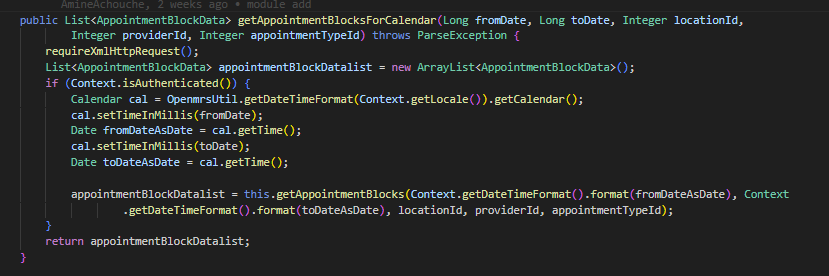
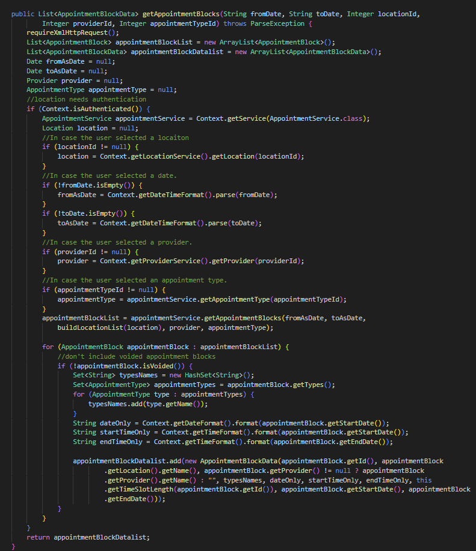
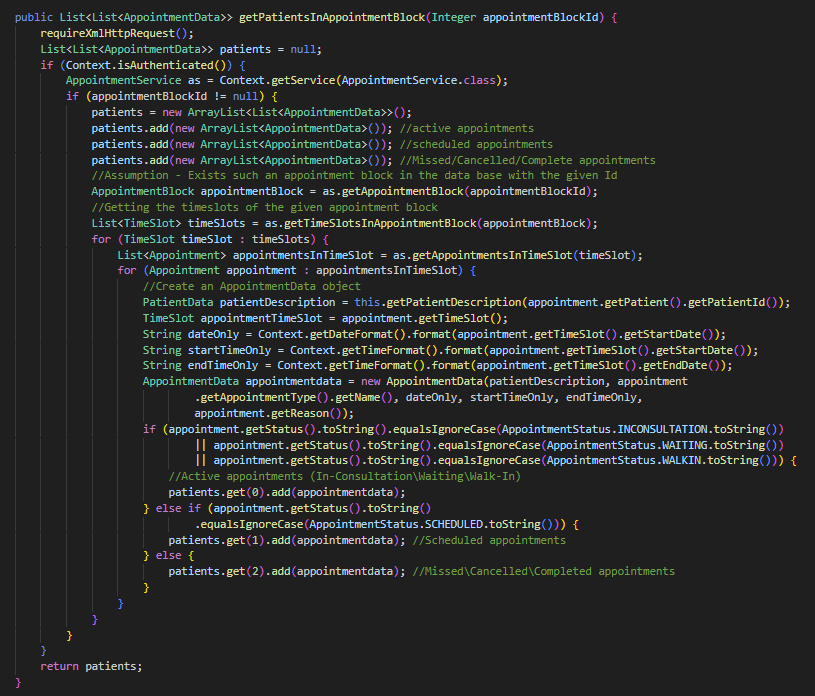
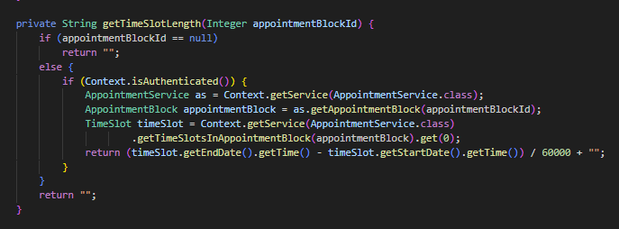
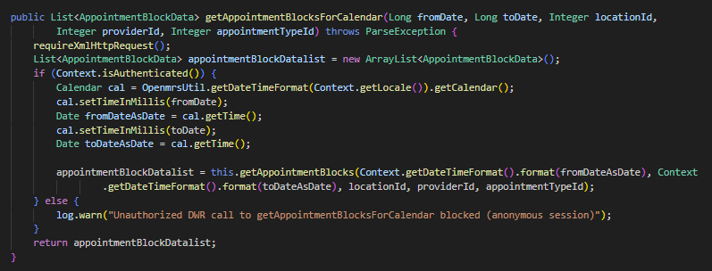
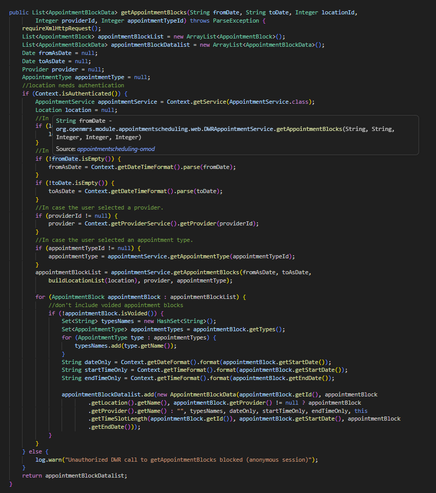
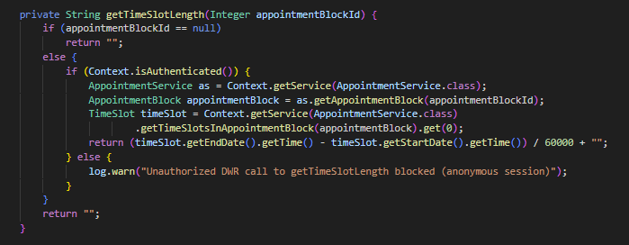
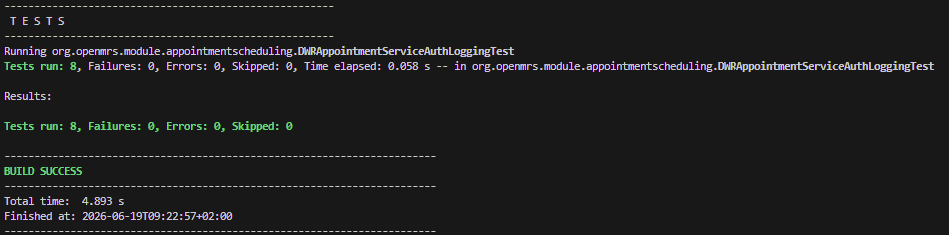

# B-06 — Geen auth-logging op anonieme DWR-calls

## Gegevens

| Onderdeel | Informatie                          |
| --------- | ----------------------------------- |
| Bevinding | B-06                                |
| Ernst     | Medium                              |
| Titel     | Geen logging van anonieme DWR-calls |
| Bestand   | `DWRAppointmentService.java`        |
| Regels    | 78, 101, 152, 224                   |
| NEN-7510  | A.8.15 — Logging en monitoring      |
| Branch    | `claude/stoic-albattani-40ob71`     |

## Probleem

In `DWRAppointmentService.java` stonden vier publieke methoden die een **silent return** deden wanneer de gebruiker niet was ingelogd. De methode controleerde wel met `Context.isAuthenticated()`, maar bij `false` werd zonder enige logregel een lege lijst of lege string teruggegeven.

Hierdoor waren ongeautoriseerde aanroepen onzichtbaar in de logs: een aanvaller kon DWR-endpoints sonderen zonder dat dit ergens werd geregistreerd. Dat is in strijd met **NEN-7510 A.8.15** (logging en monitoring) en **A.8.16** (monitoring van activiteiten).

Het patroon was telkens:

```java
if (Context.isAuthenticated()) {
    // ... bestaande logica ...
}
// geen else-tak → silent return
```

De vier kwetsbare methoden zijn hieronder per regel zichtbaar.

### Regel 78 — `getAppointmentBlocksForCalendar`



### Regel 101 — `getAppointmentBlocks`



### Regel 152 — `getPatientsInAppointmentBlock`



### Regel 224 — `getTimeSlotLength`



## Abuse aantonen

De abuse werkt conceptueel als volgt:

```text
1. Een aanvaller verstuurt een DWR-call zonder geldige sessie.
2. Context.isAuthenticated() retourneert false.
3. De methode springt over de if-blok heen en retourneert een lege lijst.
4. Er wordt geen logregel weggeschreven.
5. De beheerder kan nergens zien dat er een anonieme call is geweest.
```

Daardoor kan iemand DWR-endpoints sonderen, response-timing afluisteren of een lijst opbouwen van bestaande methoden — zonder enig spoor in de logs.

## Fix

Aan elke `if (Context.isAuthenticated())` is een `else`-tak toegevoegd die een **WARN-log** schrijft. Bovenaan de klasse is een commons-logging logger gedeclareerd (consistent met de rest van de codebase, bv. `AppointmentActivator`).

Bovenaan het bestand:

```java
import org.apache.commons.logging.Log;
import org.apache.commons.logging.LogFactory;
```

In de klasse:

```java
private static final Log log = LogFactory.getLog(DWRAppointmentService.class);
```

Op elk van de vier locaties:

```java
if (Context.isAuthenticated()) {
    // ... bestaande logica ...
} else {
    log.warn("Unauthorized DWR call to <methodNaam> blocked (anonymous session)");
}
```

De log-statements bevatten alleen de methodenaam en de reden. Er wordt **geen PII** gelogd — conform SR-01/B-05.

De aangepaste code per methode:

### `getAppointmentBlocksForCalendar` — na de fix



### `getAppointmentBlocks` — na de fix



### `getPatientsInAppointmentBlock` — na de fix


### `getTimeSlotLength` — na de fix



## Controle na de fix

Er is een unit test toegevoegd: `DWRAppointmentServiceAuthLoggingTest.java`. De test volgt hetzelfde patroon als `DWRAppointmentServiceCsrfTest` en controleert per testcase:

1. Het `Log`-veld is gedeclareerd.
2. De commons-logging imports zijn aanwezig.
3. Elk van de vier methoden bevat een passende WARN-log.
4. Er staan minstens vier WARN-regels in totaal.
5. Geen van de log-regels bevat PII-velden (`getPersonName`, `getBirthdate`, `getPatientIdentifier`, `getGender`).

De test is uitgevoerd met:

```bash
cd openmrs-module-appointmentscheduling/openmrs-module-appointmentscheduling/omod
mvn -Dtest=DWRAppointmentServiceAuthLoggingTest test
```

Onderstaande foto laat zien dat alle 8 testcases slagen.



## Resultaat

B-06 is opgelost.

Vóór de fix logde `DWRAppointmentService.java` niets wanneer een niet-geauthenticeerde gebruiker een DWR-call deed. Na de fix verschijnt voor iedere anonieme call een WARN-regel in de applicatielog, waardoor beheerders en SIEM-tools deze pogingen kunnen waarnemen en correleren.

Hiermee voldoet de module aan **NEN-7510 A.8.15** (logging en monitoring) en sluit het aan op de logverwerkingsketen die later via SR-13 / SR-14 wordt uitgebouwd.
