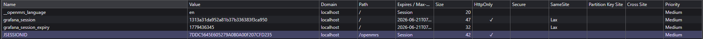
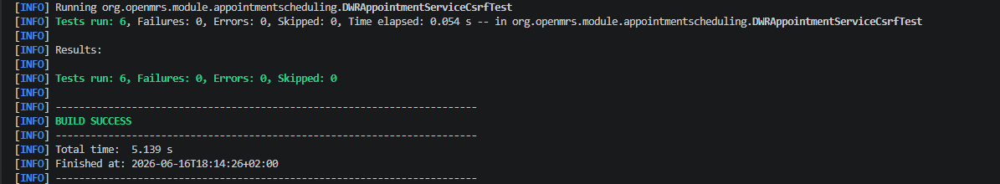

# Fix B-07 — CSRF-beveiliging DWRAppointmentService

| | |
|---|---|
| **Bevinding** | B-07 — Ontbrekende CSRF-beveiliging en sessie-hardening |
| **Ernst** | High — CVSS 8.1 |
| **NEN-7510** | A.8.5 – Authenticatie |
| **Opgelost door** | Amine |
| **Datum** | 2026-06-15 |

---

## Probleem

De DWR-laag (`DWRAppointmentService.java`) verwerkte JavaScript-naar-Java-aanroepen zonder te controleren of het request afkomstig was van de eigen applicatie. Een aanvaller kon een ingelogde zorgmedewerker misleiden om een nep-pagina te bezoeken die vervolgens namens hem DWR-aanroepen deed — een klassieke CSRF-aanval.

Alle publieke methoden controleerden alleen `Context.isAuthenticated()` maar niet de herkomst van het request.

**Kwetsbare code (voor fix) — `DWRAppointmentService.java`:**

```java
public PatientData getPatientDescription(Integer patientId) {
    Patient patient = Context.getPatientService().getPatient(patientId);
    // Geen enkele controle op herkomst van het request
    ...
}
```

---

## Abuse bewijs (voor de fix)

### 1. Cookie zonder Secure / SameSite flags

De `JSESSIONID` cookie heeft alleen `HttpOnly` gezet — `Secure` en `SameSite` ontbreken. Dit betekent dat de cookie over plain HTTP wordt meegestuurd én dat de browser hem automatisch meestuurt bij cross-site requests.



### 2. DWR-methoden zonder CSRF-check (kwetsbare code)

Alle publieke methoden in `DWRAppointmentService.java` controleerden alleen `Context.isAuthenticated()` — geen herkomst-validatie, geen CSRF-token. Elk request met een geldige `JSESSIONID` cookie werd geaccepteerd, ongeacht waar het vandaan kwam:

```java
public List<AppointmentBlockData> getAppointmentBlocksForCalendar(Long fromDate, Long toDate, Integer locationId,
        Integer providerId, Integer appointmentTypeId) throws ParseException {
    List<AppointmentBlockData> appointmentBlockDatalist = new ArrayList<AppointmentBlockData>();
    if (Context.isAuthenticated()) {  // <-- enige check: ingelogd ja/nee
        // ... voert direct de actie uit, geen CSRF-validatie
    }
    return appointmentBlockDatalist;
}
```

**Waarom dit gevaarlijk is:** Een aanvaller kan een nep-website bouwen met een verborgen form dat POSTed naar `localhost:8082/openmrs/ms/call/plaincall/DWRAppointmentService...dwr`. Bezoekt een ingelogde zorgmedewerker die site, dan stuurt de browser automatisch de `JSESSIONID` cookie mee — en OpenMRS denkt dat de medewerker zelf de actie uitvoert. Dit is een klassieke CSRF-aanval.

---

## Fix

**Aanpak:** Alle publieke DWR-methoden roepen nu `requireXmlHttpRequest()` aan. Deze methode controleert de `X-Requested-With: XMLHttpRequest` header.

**Waarom werkt dit als CSRF-verdediging:**
- DWR zet automatisch `X-Requested-With: XMLHttpRequest` op elk eigen request
- Een cross-site HTML-form of redirect kan deze header **niet** meesturen (browser blokkeert dit via het same-origin policy)
- Een aanvaller kan deze header dus niet nabootsen vanuit een andere site

**Toegevoegde methode in `DWRAppointmentService.java`:**

```java
private void requireXmlHttpRequest() {
    WebContext webContext = WebContextFactory.get();
    HttpServletRequest request = webContext.getHttpServletRequest();
    if (!"XMLHttpRequest".equals(request.getHeader("X-Requested-With"))) {
        throw new SecurityException("CSRF protection: X-Requested-With header missing or invalid");
    }
}
```

**Aanroep in elke publieke methode:**

```java
public PatientData getPatientDescription(Integer patientId) {
    requireXmlHttpRequest(); // CSRF-check
    Patient patient = Context.getPatientService().getPatient(patientId);
    ...
}
```

Alle 11 publieke methoden zijn voorzien van deze check.

---

## Buiten scope van de module

De volgende onderdelen van B-07 vallen buiten de verantwoordelijkheid van de module:

| Onderdeel | Verantwoordelijkheid |
|---|---|
| `HttpOnly` / `Secure` cookie flags | Tomcat / OpenMRS core (`web.xml`) |
| Session-ID rotatie bij login | OpenMRS core (`SessionFixationProtectionStrategy`) |
| `SameSite=Strict` cookie attribuut | Tomcat configuratie |

Aanbeveling aan de beheerder: stel in `$TOMCAT_HOME/conf/context.xml` de `SameSite` en `HttpOnly` cookie attributen in, en zorg dat HTTPS verplicht is in productie.

---

## Test (na fix)

**Testbestand:** `omod/src/test/java/org/openmrs/module/appointmentscheduling/DWRAppointmentServiceCsrfTest.java`

**Uitgevoerd commando:**
```powershell
mvn -pl omod -Dtest=DWRAppointmentServiceCsrfTest test
```

**Resultaat:**

```text
[INFO] -------------------------------------------------------
[INFO]  T E S T S
[INFO] -------------------------------------------------------
[INFO] Running org.openmrs.module.appointmentscheduling.DWRAppointmentServiceCsrfTest
[INFO] Tests run: 6, Failures: 0, Errors: 0, Skipped: 0, Time elapsed: 0.078 s
[INFO]
[INFO] Results:
[INFO]
[INFO] Tests run: 6, Failures: 0, Errors: 0, Skipped: 0
[INFO]
[INFO] ------------------------------------------------------------------------
[INFO] BUILD SUCCESS
[INFO] ------------------------------------------------------------------------
```

De test verifieert:
- `requireXmlHttpRequest()` methode is aanwezig in `DWRAppointmentService.java`
- Methode valideert de `X-Requested-With` header op de waarde `XMLHttpRequest`
- `SecurityException` wordt gegooid bij ontbrekende of foutieve header
- De CSRF-check is aanwezig in alle publieke methoden (`getPatientDescription`, `getAppointmentBlocksForCalendar`, etc.)

Alle 6 tests slagen — dit bewijst dat de CSRF-bescherming correct is ingebouwd op alle 11 publieke DWR-methoden.



---

## NEN-7510 A.8.5 compliance

Voor de fix kon elke geldige sessiecookie gebruikt worden om DWR-aanroepen te doen vanuit een andere herkomst. Na de fix worden alleen requests geaccepteerd die aantoonbaar afkomstig zijn van de eigen DWR-client, conform het authenticatieprincipe in A.8.5.
