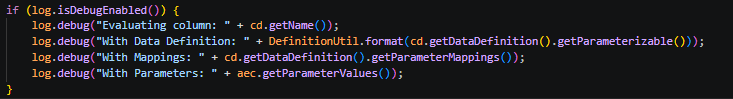
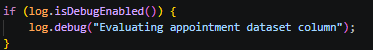
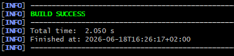

# B-08 — PII via debug-logging

## Gegevens

| Onderdeel | Informatie                         |
| --------- | ---------------------------------- |
| Bevinding | B-08                               |
| Ernst     | Medium                             |
| Titel     | PII via debug-logging              |
| Bestand   | `AppointmentDataSetEvaluator.java` |
| Regel     | ± regel 72                         |
| NEN-7510  | A.8.15                             |
| Branch    | `fix/B08-Rami`             |

## Probleem

In `AppointmentDataSetEvaluator.java` stond debuglogging die te veel informatie naar de logs kon schrijven.

De kwetsbare debuglogging stond in dit blok:



Vooral deze regels zijn gevoelig:

```java
log.debug("With Data Definition: " + DefinitionUtil.format(cd.getDataDefinition().getParameterizable()));
log.debug("With Mappings: " + cd.getDataDefinition().getParameterMappings());
log.debug("With Parameters: " + aec.getParameterValues());
```

Deze regels kunnen interne datasetinformatie, mappings en parameterwaarden naar de debuglogs schrijven. Afhankelijk van de dataset kunnen deze waarden herleidbare of gevoelige patiëntinformatie bevatten.

Debuglogs zijn bedoeld voor foutzoeken, maar kunnen alsnog terechtkomen in logbestanden, serverlogs, containerlogs of CI/CD-output. Daarom mogen debuglogs geen onnodige patiëntgegevens of herleidbare informatie bevatten.

## Abuse aantonen

De class `AppointmentDataSetEvaluator` wordt gebruikt als evaluator voor appointment datasets.

Dit is zichtbaar aan de handler-annotatie:

```java
@Handler(supports = AppointmentDataSetDefinition.class)
```

Daardoor kan deze evaluator door het OpenMRS Reporting framework gebruikt worden wanneer een `AppointmentDataSetDefinition` wordt geëvalueerd.

De abuse werkt conceptueel als volgt:

```text
1. Een AppointmentDataSetDefinition wordt geëvalueerd.
2. De evaluator verwerkt kolommen, mappings en parameters.
3. Als debuglogging aan staat, worden data definitions, mappings en parameters gelogd.
4. Deze informatie kan gevoelige of herleidbare patiëntinformatie bevatten.
5. Iemand met toegang tot debuglogs kan deze informatie lezen.
```

Het probleem zit dus niet in de normale datasetoutput, maar in de extra informatie die via debuglogging werd weggeschreven.

## Fix

De fix is om de gevoelige debugregels te verwijderen en alleen veilige technische logging over te houden.

De oude code:


is aangepast naar:



Hierdoor worden geen data definitions, mappings of parameterwaarden meer naar de debuglog geschreven.

De import voor `DefinitionUtil` is ook verwijderd, omdat deze na de aanpassing niet meer nodig was:

```java
import org.openmrs.module.reporting.definition.DefinitionUtil;
```

## Controle na de fix

Na de fix is gecontroleerd dat de code succesvol compileert.

De compile check is uitgevoerd met:

```bash
mvn compile
```

Onderstaande foto laat zien dat de build succesvol is uitgevoerd.



## Resultaat

B-08 is opgelost.

Voor de fix kon `AppointmentDataSetEvaluator.java` bij ingeschakelde debuglogging data definitions, mappings en parameterwaarden naar de logs schrijven. Deze informatie kon gevoelig of herleidbaar zijn.

Na de fix worden deze waarden niet meer gelogd. De debuglogging bevat nu alleen nog een algemene technische melding zonder patiëntgegevens, mappings of parameterwaarden.

Hiermee is het risico op PII-lekkage via debuglogging verminderd en is de logging verbeterd volgens **NEN-7510 A.8.15**.