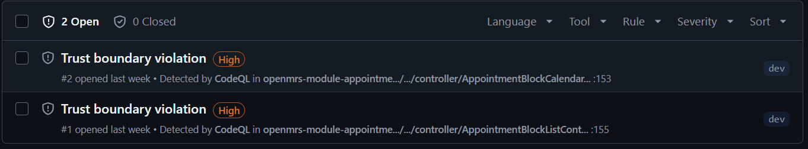
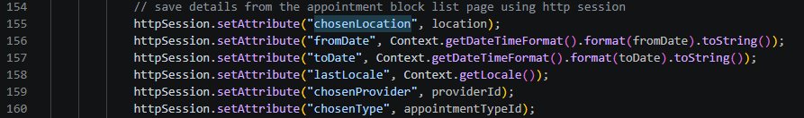
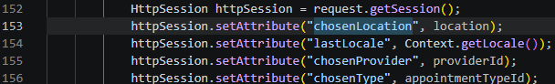
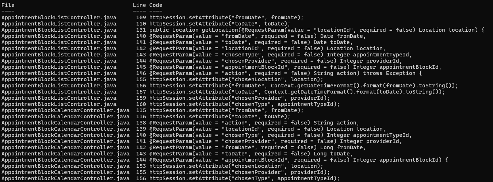
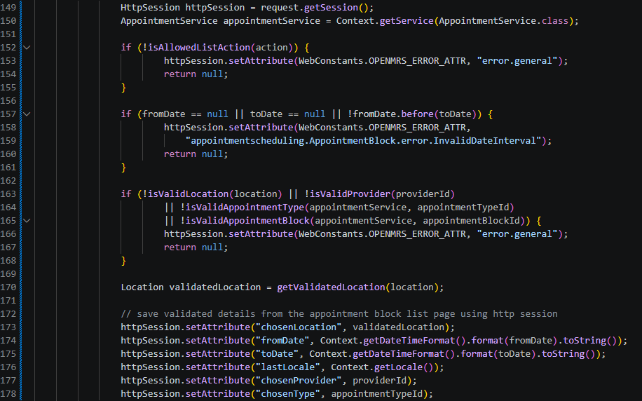
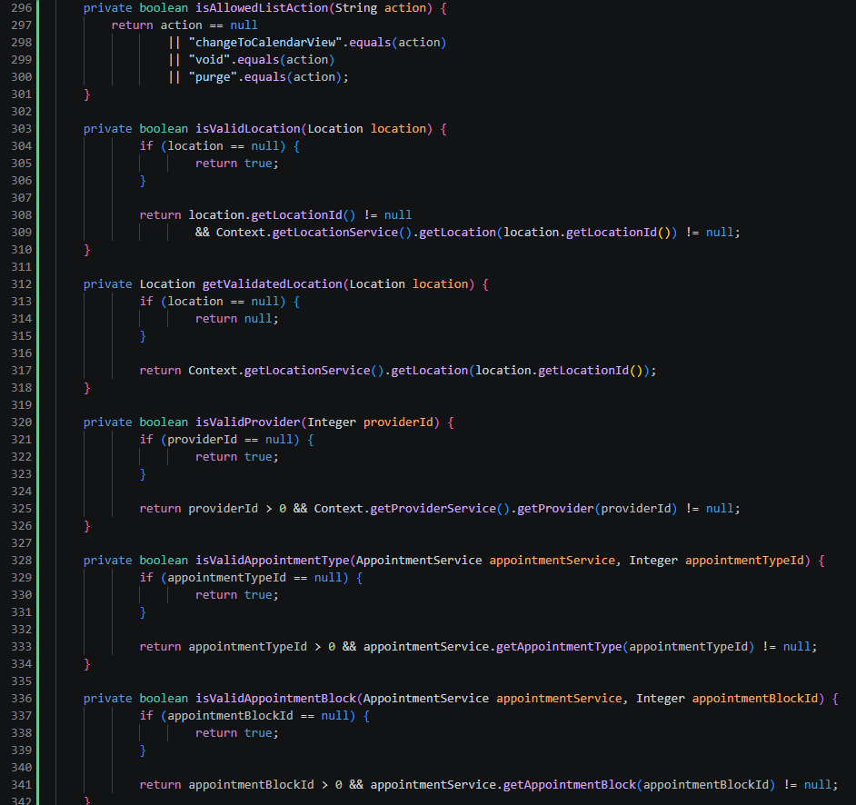

Op onderstaande foto is te zien dat request-parameters zoals `locationId`, `chosenType`, `chosenProvider`, `fromDate` en `toDate` vóór de fix direct werden verwerkt en opgeslagen in de sessie met `httpSession.setAttribute(...)`.

