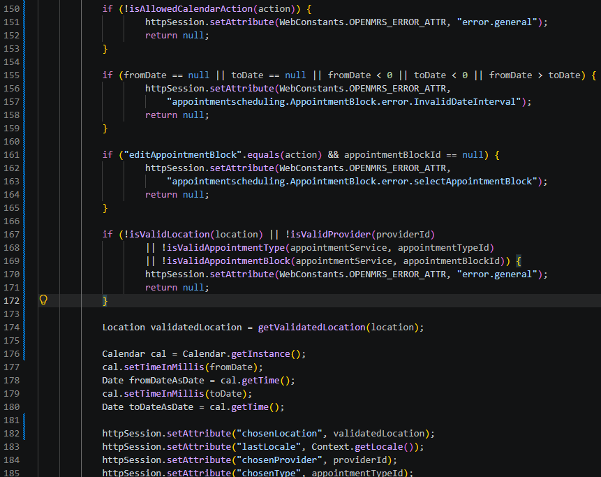
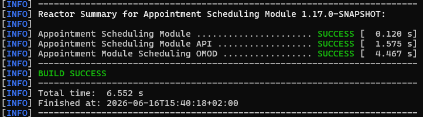
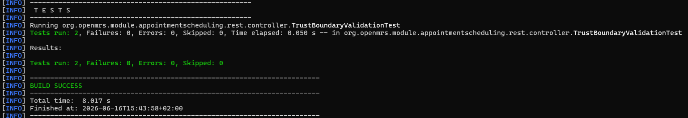

# B-10 & B-11 — Trust boundary violation in AppointmentBlock controllers

## Gegevens

| Onderdeel | Informatie                                                                         |
| --------- | ---------------------------------------------------------------------------------- |
| Bevinding | B-10 en B-11                                                                       |
| Ernst     | High                                                                               |
| Titel     | Trust boundary violation                                                           |
| Bestanden | `AppointmentBlockListController.java` en `AppointmentBlockCalendarController.java` |
| Tool      | CodeQL                                                                             |
| NEN-7510  | A.8.3                                                                              |
| Branch    | `fix/b10-b11-Nick`                                                                 |

## Probleem

B-10 en B-11 gaan over een trust boundary violation. Hierbij werd input uit een HTTP-request te snel vertrouwd en daarna opgeslagen in de sessie met `httpSession.setAttribute(...)`.

Het risico hiervan is dat waarden zoals `locationId`, `chosenType`, `chosenProvider`, `fromDate`, `toDate`, `appointmentBlockId` en `action` vanuit de request komen, maar vóór de fix niet eerst voldoende werden gevalideerd. Daardoor kon ongeldige of gemanipuleerde input worden opgeslagen in de sessie of worden gebruikt in redirects en controllerlogica.

Op onderstaande foto zijn de CodeQL-bevindingen voor B-10 en B-11 te zien.


## Abuse / bewijs vóór de fix

Voor B-10 is gekeken naar `AppointmentBlockListController.java`. In deze controller kwamen request-parameters binnen via `@RequestParam` en werden waarden daarna opgeslagen in de sessie.

Op onderstaande foto is de kwetsbare code vóór de fix te zien in `AppointmentBlockListController.java`.


Voor B-11 is hetzelfde patroon gevonden in `AppointmentBlockCalendarController.java`. Ook hier werden request-parameters verwerkt en opgeslagen in de sessie.

Op onderstaande foto is de kwetsbare code vóór de fix te zien in `AppointmentBlockCalendarController.java`.


Daarnaast is met PowerShell gecontroleerd waar request-parameters en sessie-opslag voorkwamen.

Gebruikte command:

```powershell
$controllerPath = ".\openmrs-module-appointmentscheduling\openmrs-module-appointmentscheduling\omod\src\main\java\org\openmrs\module\appointmentscheduling\web\controller"

Select-String -Path `
"$controllerPath\AppointmentBlockListController.java", `
"$controllerPath\AppointmentBlockCalendarController.java" `
-Pattern "@RequestParam|setAttribute\(""chosenLocation|setAttribute\(""chosenProvider|setAttribute\(""chosenType|setAttribute\(""fromDate|setAttribute\(""toDate" |
ForEach-Object {
    [PSCustomObject]@{
        File = Split-Path $_.Path -Leaf
        Line = $_.LineNumber
        Code = $_.Line.Trim()
    }
} | Format-Table -AutoSize -Wrap
```

Op onderstaande foto is te zien dat request-parameters zoals `locationId`, `chosenType`, `chosenProvider`, `fromDate` en `toDate` vóór de fix direct werden verwerkt en opgeslagen in de sessie met `httpSession.setAttribute(...)`.


## Fix

De fix is dat request-input eerst wordt gevalideerd voordat deze input in de sessie wordt opgeslagen of wordt gebruikt in verdere controllerlogica.

Voor B-10 is in `AppointmentBlockListController.java` validatie toegevoegd voor:

- toegestane acties via een whitelist;
- `fromDate` en `toDate`;
- `location`;
- `providerId`;
- `appointmentTypeId`;
- `appointmentBlockId`.

Hierdoor wordt input niet meer blind vertrouwd. Pas na de validatie worden waarden opgeslagen in de sessie.

Op onderstaande foto is de aangepaste validatie in `AppointmentBlockListController.java` te zien.


Daarnaast zijn helper-methodes toegevoegd om de invoer overzichtelijk te valideren.


Voor B-11 is in `AppointmentBlockCalendarController.java` dezelfde soort validatie toegevoegd. Ook daar worden acties, datums, locatie, provider, appointment type en appointment block gecontroleerd voordat waarden worden opgeslagen in de sessie.

Op onderstaande foto is de aangepaste validatie in `AppointmentBlockCalendarController.java` te zien.



## Build na de fix

Na de codewijzigingen is de module opnieuw gebouwd met Maven.

Gebruikte command:

```powershell
mvn -f .\openmrs-module-appointmentscheduling\openmrs-module-appointmentscheduling\pom.xml -pl omod -am -DskipTests package
```

Onderstaande foto laat zien dat de build succesvol is uitgevoerd.



## Test na de fix

Na de fix is een unit test toegevoegd:

```text
TrustBoundaryValidationTest
```

Deze test controleert dat:

- `AppointmentBlockListController` request-input valideert vóór sessie-opslag;
- `AppointmentBlockCalendarController` request-input valideert vóór sessie-opslag;
- acties worden beperkt met een whitelist;
- datumbereiken worden gecontroleerd;
- locatie, provider, appointment type en appointment block worden gevalideerd;
- `httpSession.setAttribute(...)` pas na validatie plaatsvindt.

De test is uitgevoerd met:

```powershell
mvn -f .\openmrs-module-appointmentscheduling\openmrs-module-appointmentscheduling\pom.xml -pl omod -Dtest=TrustBoundaryValidationTest test
```

Onderstaande foto laat zien dat de unit test succesvol is uitgevoerd.



## Resultaat

B-10 en B-11 zijn opgelost. De controllers vertrouwen request-input niet meer direct, maar valideren de input eerst voordat deze in de sessie wordt opgeslagen of gebruikt wordt in redirects en controllerlogica.

Hierdoor is het risico op trust boundary violations verminderd. Deze fix versterkt de toegangsbeveiliging en invoercontrole volgens NEN-7510 A.8.3.
