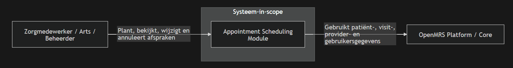
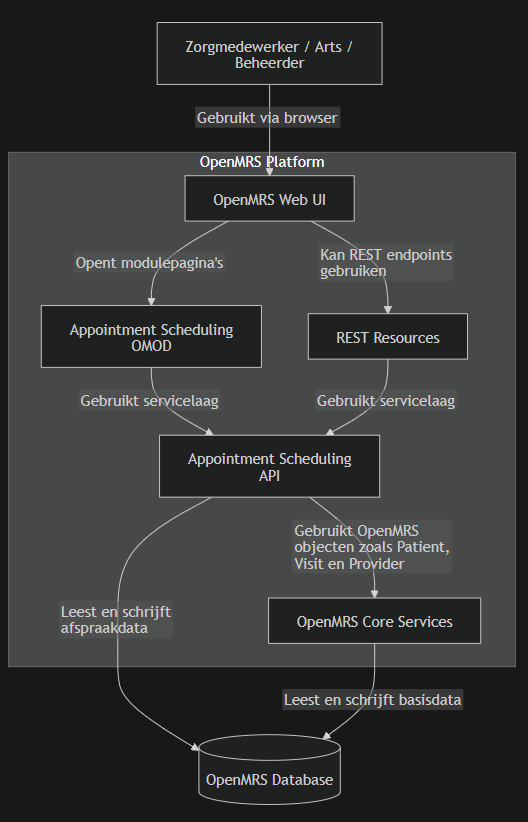
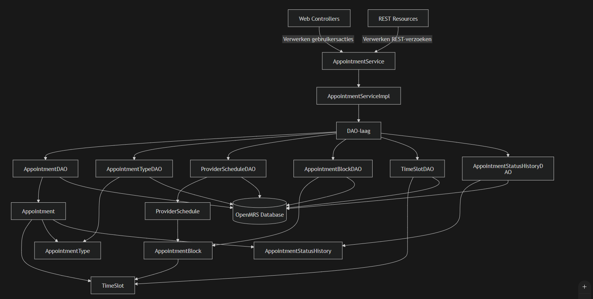
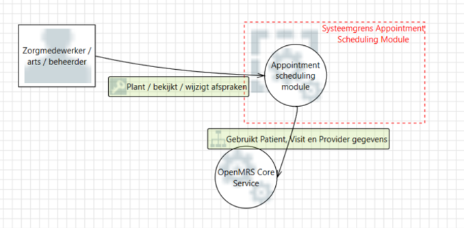
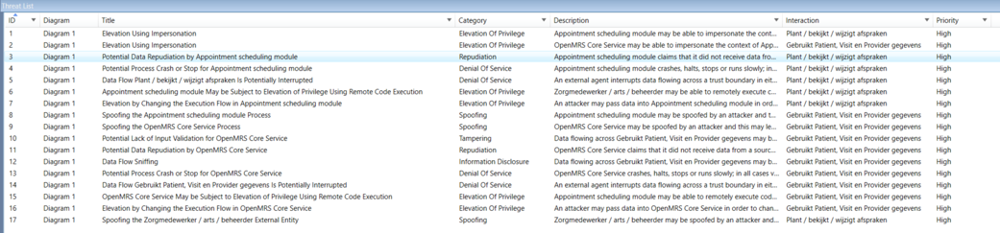
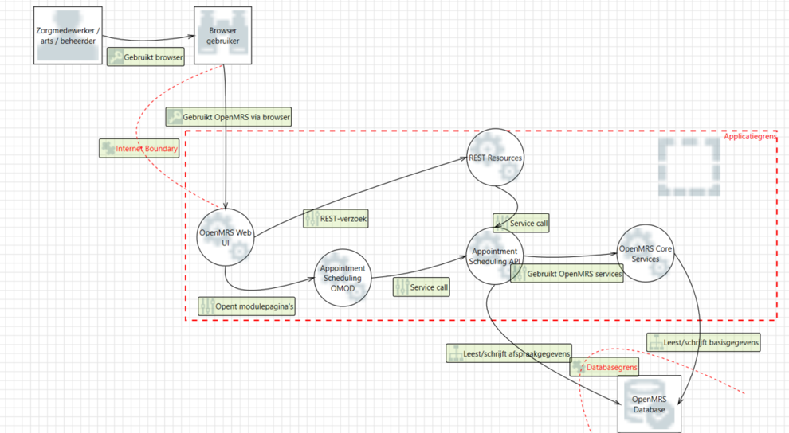
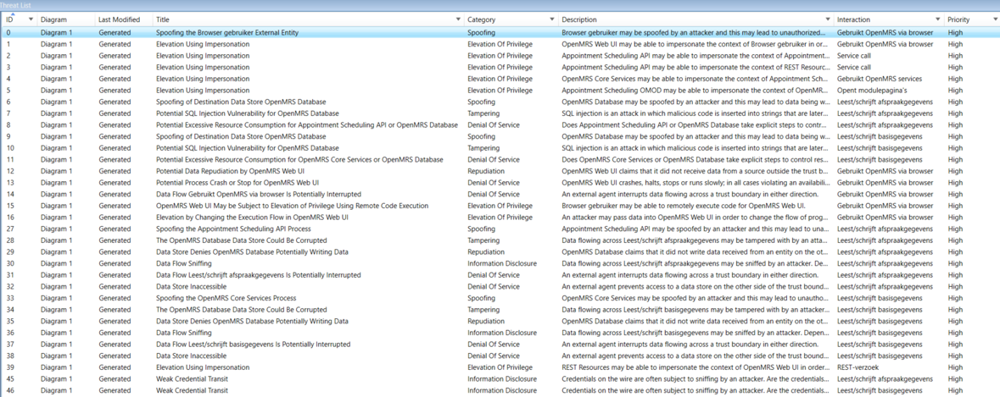

# Threat Model – OpenMRS Appointment Scheduling Module

## 1. Inleiding

Dit document beschrijft het threat model van de **OpenMRS Appointment Scheduling Module**. De module wordt gebruikt om patiëntafspraken te plannen, bekijken, wijzigen en annuleren binnen OpenMRS.

Voor dit threat model zijn eerst de C4-diagrammen uitgewerkt op drie niveaus:

- **C1 – Contextdiagram**
- **C2 – Containerdiagram**
- **C3 – Componentdiagram**

Daarna is met **Microsoft Threat Modeling Tool 2016** een Level 0 en Level 1 threat model gemaakt. De tool heeft automatisch threats gegenereerd op basis van de gemaakte Data Flow Diagrams. Niet alle gegenereerde threats zijn volledig uitgewerkt. In dit document zijn de **8 belangrijkste threats** geselecteerd, omdat deze het meest relevant zijn voor patiëntafspraken, afspraakgegevens en beschikbaarheid van de module.

---

## 2. C4-model

### 2.1 C1 – Contextdiagram

Het contextdiagram laat zien welke externe actoren en systemen betrokken zijn bij de Appointment Scheduling Module. De module is het systeem-in-scope. Zorgmedewerkers, artsen en beheerders gebruiken de module om afspraken te plannen en te beheren.



---

### 2.2 C2 – Containerdiagram

Het containerdiagram laat zien uit welke technische hoofdonderdelen de module bestaat. De gebruiker werkt via de OpenMRS webinterface. De module gebruikt onder andere de Appointment Scheduling OMOD, REST Resources, Appointment Scheduling API, OpenMRS Core Services en de OpenMRS Database.



---

### 2.3 C3 – Componentdiagram

Het componentdiagram zoomt in op de Appointment Scheduling Module. De belangrijkste onderdelen zijn de webcontrollers, REST-resources, servicelaag, DAO-laag en domeinklassen zoals `Appointment`, `AppointmentType`, `ProviderSchedule`, `AppointmentBlock`, `TimeSlot` en `AppointmentStatusHistory`.



---

## 3. Methode threat modelling

Voor het threat model is gebruikgemaakt van **Microsoft Threat Modeling Tool 2016**. Deze tool genereert threats op basis van een Data Flow Diagram. De gegenereerde threats zijn gebaseerd op de STRIDE-methode.

| STRIDE                 | Betekenis                                  | Voorbeeld binnen deze module                     |
| ---------------------- | ------------------------------------------ | ------------------------------------------------ |
| Spoofing               | Iemand doet zich voor als iemand anders    | Aanvaller doet zich voor als zorgmedewerker      |
| Tampering              | Data wordt ongewenst aangepast             | Afspraakgegevens worden aangepast zonder rechten |
| Repudiation            | Acties zijn niet herleidbaar               | Niet duidelijk wie een afspraak heeft gewijzigd  |
| Information Disclosure | Gegevens worden zichtbaar voor onbevoegden | Patiëntafspraken worden gelekt                   |
| Denial of Service      | Systeem of functie wordt onbeschikbaar     | Afsprakenmodule of database valt uit             |
| Elevation of Privilege | Gebruiker krijgt te veel rechten           | Gewone gebruiker kan beheeracties uitvoeren      |

De gegenereerde threats zijn niet allemaal overgenomen. Er is een selectie gemaakt van de threats die het meest relevant zijn voor de Appointment Scheduling Module en de CIA/BIV-impact van patiëntafspraken.

---

## 4. Microsoft Threat Modeling Tool 2016 – Level 0

### 4.1 Level 0 DFD

Het Level 0 threat model is gebaseerd op het C1-contextdiagram. Hierin wordt vooral gekeken naar externe actoren en de systeemgrens van de Appointment Scheduling Module.



---

### 4.2 Gegenereerde threats Level 0

De Microsoft Threat Modeling Tool heeft meerdere threats gegenereerd voor het Level 0-diagram. De volledige gegenereerde lijst is als screenshot opgenomen. Daarna zijn de relevante threats geselecteerd.



### 4.3 Geselecteerde Level 0 threats

| ID    | STRIDE            | Threat uit Microsoft Threat Modeling Tool                         | Eigen vertaling                                                     | Waarom relevant?                                                                    |
| ----- | ----------------- | ----------------------------------------------------------------- | ------------------------------------------------------------------- | ----------------------------------------------------------------------------------- |
| L0-T1 | Spoofing          | Spoofing the Zorgmedewerker / arts / beheerder External Entity    | Een aanvaller doet zich voor als zorgmedewerker, arts of beheerder. | Kan leiden tot onbevoegde toegang tot patiëntafspraken.                             |
| L0-T2 | Repudiation       | Potential Data Repudiation by Appointment Scheduling Module       | Wijzigingen aan afspraken zijn mogelijk niet goed herleidbaar.      | Bij afspraakwijzigingen moet duidelijk zijn wie wat heeft gedaan.                   |
| L0-T3 | Denial of Service | Potential Process Crash or Stop for Appointment Scheduling Module | De Appointment Scheduling Module crasht of stopt.                   | Als de module niet beschikbaar is, kunnen afspraken niet gepland of bekeken worden. |

---

## 5. Microsoft Threat Modeling Tool 2016 – Level 1

### 5.1 Level 1 DFD

Het Level 1 threat model is gebaseerd op het C2-containerdiagram. Hierin wordt gekeken naar de containers, datastromen en trust boundaries tussen de browser, OpenMRS Web UI, OMOD, REST Resources, API, Core Services en database.



---

### 5.2 Gegenereerde threats Level 1

De Microsoft Threat Modeling Tool heeft voor het Level 1-diagram een langere lijst threats gegenereerd. Veel threats waren dubbel of algemeen. Daarom zijn alleen de threats geselecteerd die direct relevant zijn voor de Appointment Scheduling Module.



### 5.3 Geselecteerde Level 1 threats

| ID    | STRIDE                 | Threat uit Microsoft Threat Modeling Tool                                                   | Eigen vertaling                                                   | Waarom relevant?                                                                |
| ----- | ---------------------- | ------------------------------------------------------------------------------------------- | ----------------------------------------------------------------- | ------------------------------------------------------------------------------- |
| L1-T1 | Spoofing               | Spoofing the Browser gebruiker External Entity                                              | De browser of gebruikerssessie kan worden misbruikt.              | Sessie- of browsermisbruik kan leiden tot toegang tot afspraakgegevens.         |
| L1-T2 | Tampering              | Potential SQL Injection Vulnerability for OpenMRS Database                                  | Kwaadaardige input kan richting database worden gestuurd.         | De module leest en schrijft afspraakgegevens naar de OpenMRS Database.          |
| L1-T3 | Denial of Service      | Potential Excessive Resource Consumption for Appointment Scheduling API or OpenMRS Database | De API of database kan overbelast raken.                          | Overbelasting kan de afspraakplanning vertragen of tijdelijk onbruikbaar maken. |
| L1-T4 | Repudiation            | Potential Data Repudiation by OpenMRS Web UI                                                | Acties via de OpenMRS Web UI zijn mogelijk niet goed herleidbaar. | Gebruikersacties via de webinterface moeten controleerbaar zijn.                |
| L1-T5 | Information Disclosure | Weak Credential Transit                                                                     | Inloggegevens worden mogelijk onvoldoende beschermd verzonden.    | Zwakke overdracht van credentials kan leiden tot accountmisbruik.               |

---

## 6. Selectie van de 8 belangrijkste threats

De Microsoft Threat Modeling Tool heeft meer threats gegenereerd dan in dit document volledig worden uitgewerkt. Voor verdere analyse zijn de **8 belangrijkste threats** geselecteerd. Deze threats zijn gekozen omdat ze realistisch kunnen voorkomen binnen de Appointment Scheduling Module en een duidelijke impact hebben op vertrouwelijkheid, integriteit of beschikbaarheid.

| ID  | Level   | STRIDE                 | Threat                                                          | Betrokken onderdeel           | CIA/BIV-impact                  |
| --- | ------- | ---------------------- | --------------------------------------------------------------- | ----------------------------- | ------------------------------- |
| T1  | Level 0 | Spoofing               | Aanvaller doet zich voor als zorgmedewerker, arts of beheerder. | Gebruiker / browser           | Vertrouwelijkheid               |
| T2  | Level 0 | Repudiation            | Wijzigingen aan afspraken zijn niet goed herleidbaar.           | Appointment Scheduling Module | Integriteit                     |
| T3  | Level 0 | Denial of Service      | Appointment Scheduling Module crasht of stopt.                  | Appointment Scheduling Module | Beschikbaarheid                 |
| T4  | Level 1 | Spoofing               | Browser of gebruikerssessie wordt misbruikt.                    | Browser gebruiker             | Vertrouwelijkheid               |
| T5  | Level 1 | Tampering              | SQL Injection richting OpenMRS Database.                        | API → Database                | Vertrouwelijkheid + integriteit |
| T6  | Level 1 | Denial of Service      | API of database raakt overbelast.                               | API / Database                | Beschikbaarheid                 |
| T7  | Level 1 | Repudiation            | Acties via OpenMRS Web UI zijn niet goed herleidbaar.           | OpenMRS Web UI                | Integriteit                     |
| T8  | Level 1 | Information Disclosure | Weak Credential Transit.                                        | Browser → OpenMRS Web UI      | Vertrouwelijkheid               |

---

## 7. Risicobeoordeling

De geselecteerde threats zijn beoordeeld met dezelfde schaal als de CIA/BIV-analyse:

```text
Risico = Kans × Impact
```

| Score | Niveau  | Betekenis                             |
| ----: | ------- | ------------------------------------- |
|   1–4 | Laag    | Acceptabel risico                     |
|   5–9 | Middel  | Monitoren en waar mogelijk verbeteren |
| 10–15 | Hoog    | Maatregel verplicht                   |
| 16–25 | Kritiek | Direct oplossen of mitigeren          |

| ID  | Threat                                                         | Kans | Impact | Score | Niveau |
| --- | -------------------------------------------------------------- | ---: | -----: | ----: | ------ |
| T1  | Aanvaller doet zich voor als zorgmedewerker, arts of beheerder |    2 |      5 |    10 | Hoog   |
| T2  | Wijzigingen aan afspraken zijn niet goed herleidbaar           |    3 |      3 |     9 | Middel |
| T3  | Appointment Scheduling Module crasht of stopt                  |    2 |      4 |     8 | Middel |
| T4  | Browser of gebruikerssessie wordt misbruikt                    |    2 |      5 |    10 | Hoog   |
| T5  | SQL Injection richting OpenMRS Database                        |    3 |      5 |    15 | Hoog   |
| T6  | API of database raakt overbelast                               |    3 |      4 |    12 | Hoog   |
| T7  | Acties via OpenMRS Web UI zijn niet goed herleidbaar           |    3 |      3 |     9 | Middel |
| T8  | Weak Credential Transit                                        |    2 |      5 |    10 | Hoog   |

---

## 8. Belangrijkste threats

De belangrijkste threats zijn:

1. **T5 – SQL Injection richting OpenMRS Database**
2. **T1 – Aanvaller doet zich voor als zorgmedewerker, arts of beheerder**
3. **T4 – Browser of gebruikerssessie wordt misbruikt**
4. **T8 – Weak Credential Transit**
5. **T6 – API of database raakt overbelast**

Deze threats hebben prioriteit omdat ze direct invloed kunnen hebben op patiëntafspraken, afspraakgegevens en de beschikbaarheid van de module.

---

## 9. Conclusie

Met Microsoft Threat Modeling Tool 2016 zijn op basis van Level 0 en Level 1 DFD’s meerdere threats gegenereerd. Niet alle threats zijn uitgewerkt; de 8 belangrijkste threats zijn geselecteerd op relevantie voor de Appointment Scheduling Module.

De belangrijkste aandachtspunten zijn onbevoegde toegang, SQL Injection, sessiemisbruik, weak credential transit en overbelasting van de API of database. Deze threats raken direct aan vertrouwelijkheid, integriteit en beschikbaarheid van patiëntafspraken.
